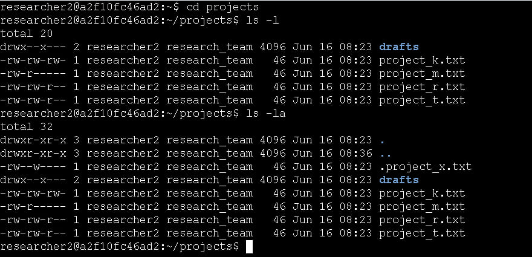
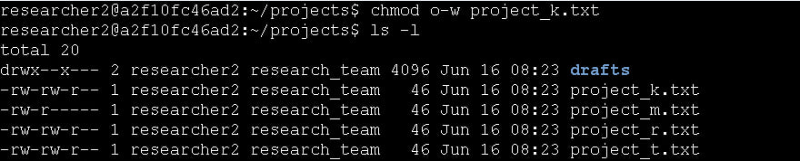
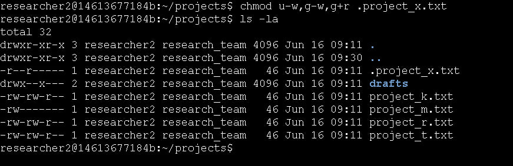
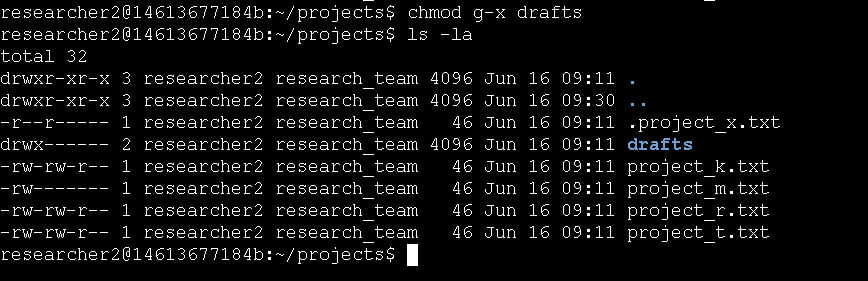

# Portfolio Project: Linux File Permissions & Authorization Management

Assessment Context: Scenario-Based Simulation (Google Cybersecurity Professional Certificate)  
Activity: Use Linux commands to manage file permissions  
Environment: Linux Bash Shell  
Role Assumed: Security Analyst  
Tools Utilized: chmod, ls -la, ls -l, cd  

> *Note: This document represents a hands-on practical activity where I assume the role of a Security Analyst enforcing the principle of least privilege through Linux file permission management.*

---

## Project Description
As a security professional at a large organization working with the research team, my responsibility is to ensure that all users are authorized with the appropriate file and directory permissions to maintain system security. In this project, I examined the existing permissions on the file system for the researcher2 user's projects directory to determine if they matched the required authorization levels. Through systematic auditing using `ls -la` and targeted modifications with `chmod` commands, I identified permission mismatches, removed unauthorized access, and ensured that only appropriate users could access sensitive research files and directories.

---

## 1. Check File and Directory Details

To begin the audit, I navigated to the projects directory and checked the permissions for all files, including hidden ones, to establish a baseline.

**Commands used:**
```bash
cd projects
ls -l
ls -la
```

**Current file permissions (from `ls -l and ls -la` output):**


### Interpreting the 10-Character Permissions String
Using `project_k.txt` as an example, the initial permission string was `-rw-rw-rw-`. 

This 10-character string dictates the file type and access levels for three distinct owner categories:
*   **Character 1 (`-`):** Identifies the file type. A hyphen indicates a regular file, while `d` indicates a directory.
*   **Characters 2-4 (`rw-`):** Represent the **user/owner** permissions. In this case, the owner has read and write access.
*   **Characters 5-7 (`rw-`):** Represent the **group** permissions. The group also has read and write access.
*   **Characters 8-10 (`rw-`):** Represent the **other/everyone** permissions. Here, everyone else has read and write access. 
*   *Note:* When a permission shows a hyphen (`-`) instead of `r`, `w`, or `x`, that specific permission is explicitly denied.

---

## 2. Change File Permissions

**Issue Identified:** The organization's security policy strictly prohibits "other" users from having write access to any files. The `ls -l` output revealed that `project_k.txt` had `-rw-rw-rw-` permissions, granting write access to everyone.

**Command used to remediate:**
```bash
chmod o-w project_k.txt
```

**Output/Result:**
After executing the command, I verified the change with `ls -l`. The permissions successfully updated from `-rw-rw-rw-` to `-rw-rw-r--`, removing write access for "other" users while maintaining read-only access.



---

## 3. Change File Permissions on a Hidden File

**Issue Identified:** The file `.project_x.txt` is a hidden, archived file. Archived data should be strictly read-only for authorized personnel (user and group) and must not be writable by anyone. The initial check showed it had incorrect write permissions.

**Command used to remediate:**
```bash
chmod u-w,g-w,g+r .project_x.txt
```

**Output/Result:**
This command simultaneously removed write permissions from the user (`u-w`) and the group (`g-w`), while explicitly ensuring the group retained read access (`g+r`). The final permissions were updated to `-r--r-----`, successfully locking the archived data against modifications.



---

## 4. Change Directory Permissions

**Issue Identified:** The `drafts` directory contained sensitive work-in-progress files. The security requirement dictated that *only* the `researcher2` user should be allowed to access the directory and its contents. In Linux, accessing a directory requires the execute (`x`) permission. The initial check showed the group had execute privileges.

**Command used to remediate:**
```bash
chmod g-x drafts
```

**Output/Result:**
After running the command and verifying with `ls -la`, the directory permissions changed from `drwx--x---` to `drwx------`. This successfully removed the execute permission from the group, ensuring that only the owner (`researcher2`) can navigate into (`cd`) and view the contents of the drafts directory.



---

## Summary
Through this authorization management exercise, I systematically audited and secured file permissions across the projects directory to enforce the principle of least privilege. By using `ls -la` to identify permission vulnerabilities and `chmod` to remove unauthorized write access, restrict archived files, and protect directory contents, I ensured compliance with organizational security policies. These tasks demonstrate essential Linux security skills including permission string interpretation, hidden file management, and access control implementation which are critical competencies for protecting sensitive data in real-world cybersecurity operations.

---

*Note: This document outlines my hands-on practice and learning proficiency in Linux file permission management, authorization controls, and security hardening skills required for cybersecurity operations.*