# Technical Exercise: Linux Package Management & Security Tool Deployment

Assessment Context: Scenario-Based Simulation (Google Cybersecurity Professional Certificate)  
Activity: Install software in a Linux distribution  
Environment: Debian-based Linux (Bash Shell)  
Role Assumed: Security Analyst / System Administrator  
Tools Utilized: apt, sudo, suricata (IDS/IPS), tcpdump (Packet Capture)  

> *Note: This document represents a hands-on practical activity where I assume the role of a Security Analyst deploying, managing, and auditing network monitoring tools on a Linux system.*

---

## Executive Summary
As a cybersecurity analyst, the ability to securely deploy, manage, and verify network monitoring tools on a Linux operating system is a foundational skill. I frequently need to deploy and manage network monitoring tools on Linux systems. Through this exercise, I built my proficiency in using the Advanced Package Tool (APT) with elevated privileges (sudo) to install, remove, and audit security applications. These skills are foundational for my daily tasks, such as deploying intrusion detection systems (IDS) and packet capture utilities in a controlled environment.

---

## 1. Environment Verification
Before deploying any software, I needed to verify that the package manager was functional and ready to handle dependencies securely.

* Action: I verified the APT installation and functionality.
* Command: apt
* Outcome: The shell returned basic usage information, version details, and a description of the tool, confirming the package manager was active and ready for use.

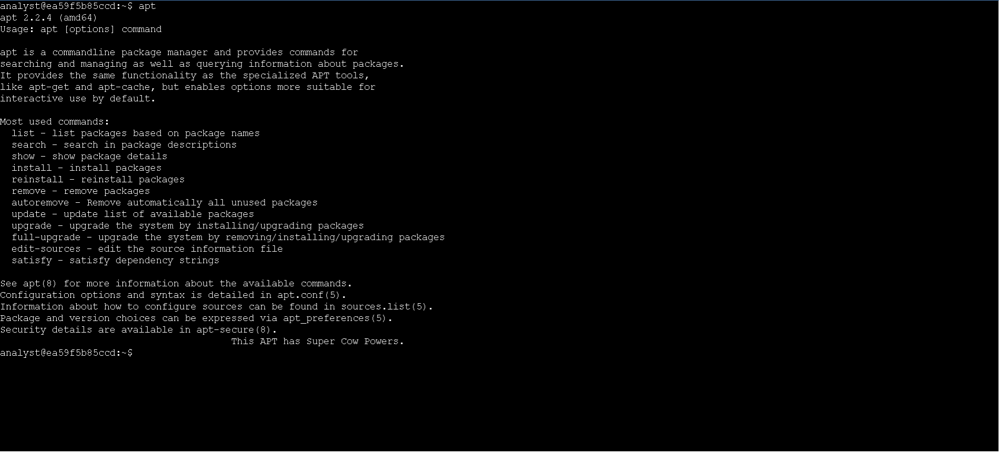
*Figure 1: Verifying the APT package manager is active and functional.*

---

## 2. Deploying and Removing Suricata (IDS)
Suricata is a high-performance network intrusion detection system. Managing its lifecycle ensures I only run necessary services, adhering to the principle of minimizing the attack surface.

### Deploying Suricata
* Action: I installed Suricata and its required dependencies.
* Command: sudo apt install suricata
* Outcome: APT resolved and downloaded the necessary dependencies, and the installation completed successfully after my confirmation.

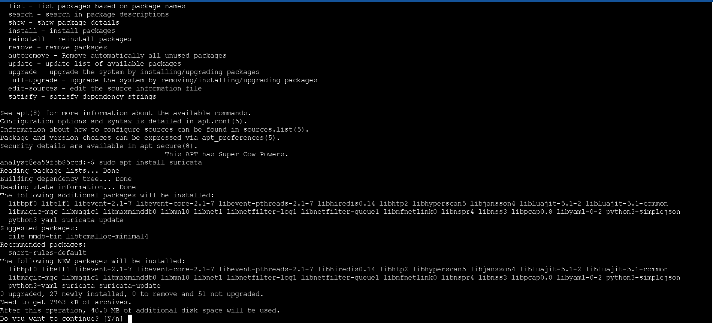
*Figure 2: Initiating the installation of Suricata via APT.*

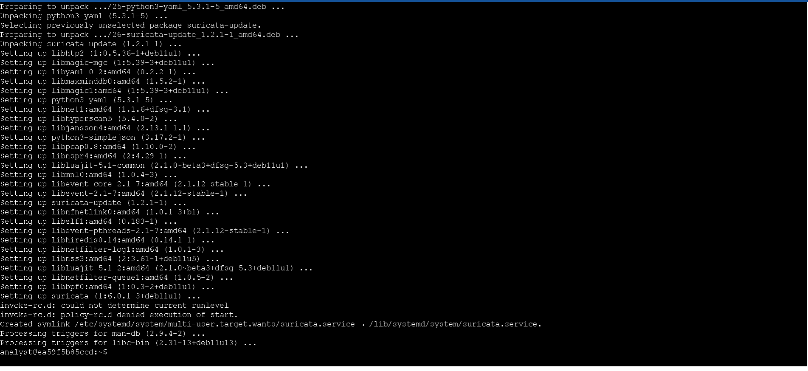
*Figure 3: APT resolving and downloading required dependencies.*

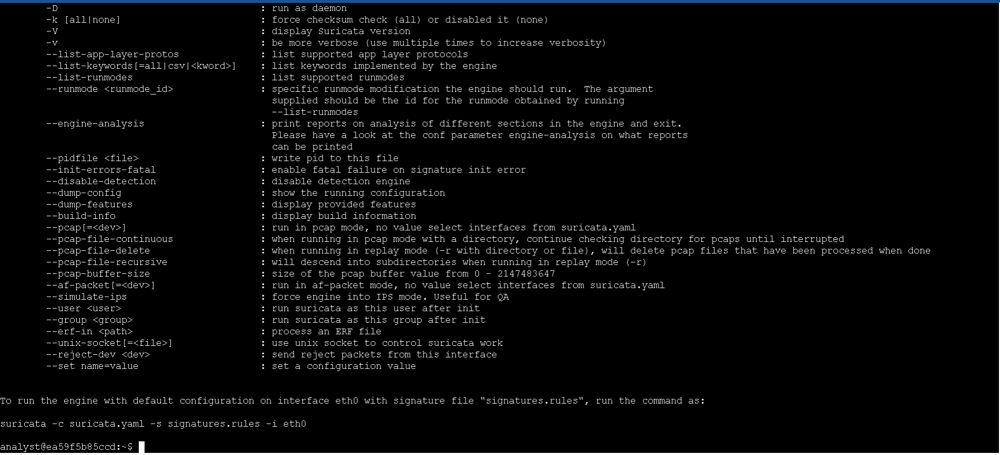
*Figure 4: Successful installation and configuration confirmation.*

### Uninstalling and Verifying Removal
* Action: I uninstalled the application to test removal procedures and verified the complete removal.
* Commands: sudo apt remove suricata followed by suricata
* Outcome: The package and its core files were removed from the system. Running the command again returned a "command not found" error, successfully validating that the application was fully uninstalled.

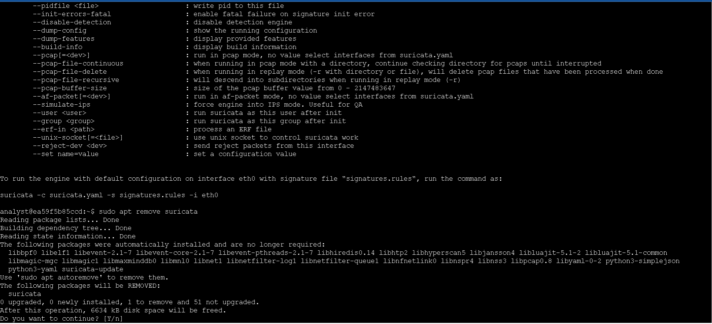
*Figure 5: Initiating the removal of the Suricata package.*

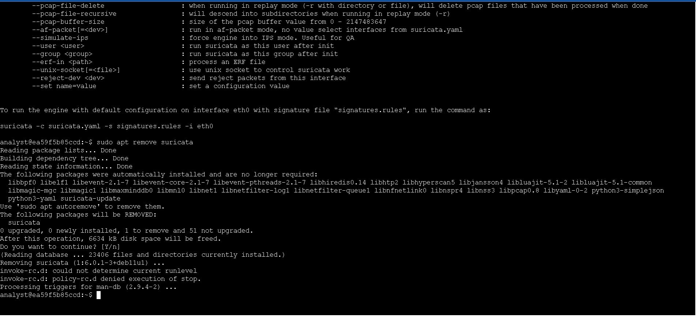
*Figure 6: Package removal process and dependency cleanup.*

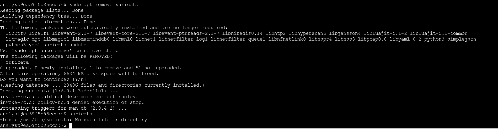
*Figure 7: Verification that Suricata is completely removed from the system path.*

---

## 3. Deploying tcpdump (Packet Capture)
tcpdump is a fundamental command-line tool for real-time network traffic analysis and troubleshooting.

* Action: I installed the packet capture utility and confirmed its presence.
* Command: sudo apt install tcpdump
* Outcome: The application and its dependencies were successfully downloaded and installed.

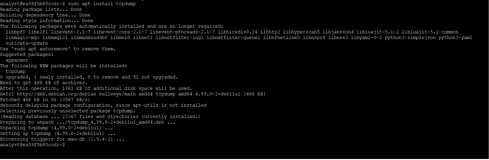
*Figure 8: Installing the tcpdump packet capture utility via APT.*

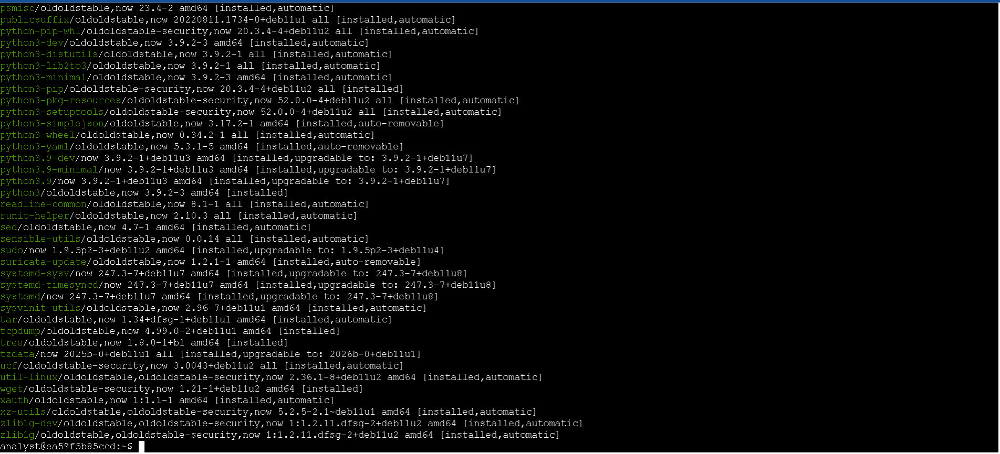
*Figure 9: Successful installation confirmation of tcpdump.*

---

## 4. System Auditing and Validation
In a production environment, I must regularly audit installed software to ensure compliance, verify versions, and detect unauthorized applications.

* Action: I generated a comprehensive list of all installed packages.
* Command: apt list --installed
* Outcome: The command outputted the full inventory of installed software. I reviewed the list and confirmed that tcpdump was present, and suricata was correctly absent, validating my previous uninstallation step.

---

## 5. Final State Restoration
To conclude the exercise and establish the required operational baseline for the security analyst role, I restored the primary IDS tool and performed a final system audit.

* Action: I reinstalled Suricata to restore the operational baseline.
* Command: sudo apt install suricata
* Outcome: The installation completed successfully.

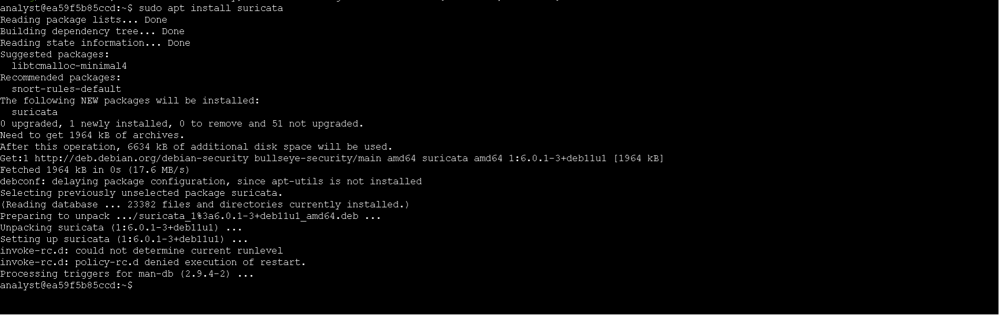
*Figure 10: Reinstalling Suricata to restore the required IDS operational baseline.*

* Action: I performed a final audit to confirm the desired end-state.
* Command: apt list --installed
* Outcome: I confirmed that both suricata and tcpdump were now successfully installed and ready for network monitoring operations.

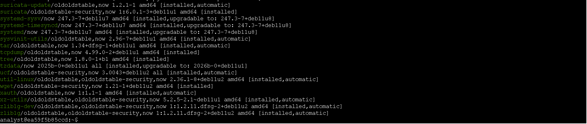
*Figure 11: Final audit confirming both Suricata and tcpdump are successfully installed.*

---

## Professional Reflection & Key Takeaways
While package management is a standard administrative task, I recognize that doing it securely and methodically is critical for cybersecurity operations.

1. Dependency Management: I learned how APT automatically handles complex software dependencies, which significantly reduces the risk of broken systems or missing libraries during tool deployment.
2. Verification is Mandatory: I reinforced the habit of never assuming an installation or removal was successful. Running the tool or checking the package list is a necessary step to validate the system state.
3. Attack Surface Reduction: I recognized that knowing how to cleanly uninstall unused tools is just as important as installing them, as every running service or installed binary is a potential vector for exploitation.

---

*Note: This document outlines my hands-on practice and learning proficiency in Linux system administration, package management, and security tool deployment.*
