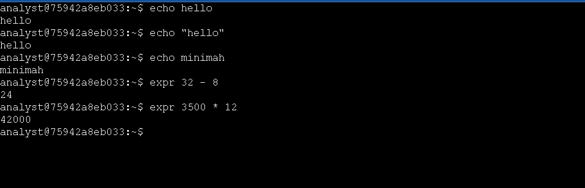

# Technical Exercise: Linux Shell Fundamentals & Input/Output Processing

**Assessment Context:** Scenario-Based Simulation (Google Cybersecurity Professional Certificate)  
**Activity:** Examine input and output in the shell  
**Environment:** Linux Bash Shell  
**Role Assumed:** Security Analyst  
**Tools Utilized:** echo (String Output), expr (Arithmetic Operations), clear (Environment Management)  

> *Note: This document represents a hands-on practical activity where I assume the role of a Security Analyst utilizing foundational Linux shell commands to process inputs and interpret outputs.*

---

## Executive Summary
Effective communication with the Linux operating system via the Bash shell is a foundational skill for any cybersecurity professional. Given that I need to interact with the Linux operating system via the Bash shell to process inputs and interpret outputs, following this practical exercise, I gained proficiency in using fundamental commands to generate text output, perform rapid arithmetic calculations, and manage the terminal environment. These skills are foundational for my daily tasks, such as parsing security logs, calculating incident metrics, and building the foundation for automated security scripting.

---

## 1. Generating Text Output (echo)
The `echo` command is used to display lines of text or string variables to the terminal. In a security context, I use this heavily in scripting to print status updates, verify that data is being captured correctly, or write notes into log files.

* **Action:** I output standard text to verify shell communication.
  * **Command:** `echo hello`
  * **Outcome:** The shell returned `hello`.
* **Action:** I output formatted strings using quotation marks.
  * **Command:** `echo "hello"`
  * **Outcome:** The shell returned `hello`.
* **Action:** I output a custom identification string.
  * **Command:** `echo "Minimah"`
  * **Outcome:** The shell returned `Minimah`.

---

## 2. Performing Security Metric Calculations (expr)
The `expr` command allows me to perform basic integer mathematics directly in the terminal. This is highly useful during incident response when I need to quickly calculate alert volumes or false positive rates without leaving the shell environment.

* **Action:** I calculated the number of false positives by subtracting actionable alerts from the total alerts.
  * **Command:** `expr 32 - 8`
  * **Outcome:** The shell returned `24`, indicating 24 false positives.
* **Action:** I projected the total expected login attempts for the year by multiplying the monthly average by 12.
  * **Command:** `expr 3500 \* 12`
  * **Outcome:** The shell returned `42000`. *(I noted that the asterisk must be escaped with a backslash in Bash to prevent it from reading as a wildcard file expansion).*

---

## 3. Managing the Terminal Environment (clear)
During active incident response or when reviewing massive log files, my terminal screen can quickly become cluttered with historical commands and outputs.

* **Action:** I reset the terminal workspace to maintain focus.
  * **Command:** `clear`
  * **Outcome:** The screen was wiped clean, and the prompt returned to the top left, providing me with a clutter-free environment to focus on current data.

---

## 4. Exploring Additional Inputs and Outputs
To further reinforce my understanding of shell I/O processing, I practiced generating additional text and performing further mathematical operations.

* **Action:** I generated a new text output.
  * **Command:** `echo "Security Analysis in Progress"`
  * **Outcome:** The shell returned the specified string.
* **Action:** I performed an additional integer calculation.
  * **Command:** `expr 25 + 15`
  * **Outcome:** The shell returned `40`. I reinforced that `expr` requires spaces between terms and operators and only processes integers.

---

### 📸 Evidence: Linux Input/Output

*Figure 1: Screenshot demonstrating Linux standard input/output redirection and command execution.*

---

## Professional Reflection & Key Takeaways
I recognize that these basic command lines represent the absolute foundation of Linux system administration and security automation.

1. **Predictable Output is Crucial:** I learned that understanding exactly how the shell receives input and returns output (or error messages) is the first step toward mastering advanced log-parsing tools like `grep`, `awk`, and `sed`. 
2. **Efficiency in Triage:** I reinforced that being able to perform quick calculations (like false positive ratios) directly in the terminal saves time during an active investigation, keeping me in my primary workspace.
3. **Scripting Foundations:** I noted that the `echo` command is the backbone of Bash scripting. Knowing how to manipulate strings and variables now paves the way for me to write automated scripts that can parse thousands of security logs in seconds.

---

*Note: This document outlines my hands-on practice and learning proficiency in foundational Linux shell navigation, command-line I/O processing, and basic operational math skills required for cybersecurity operations.*