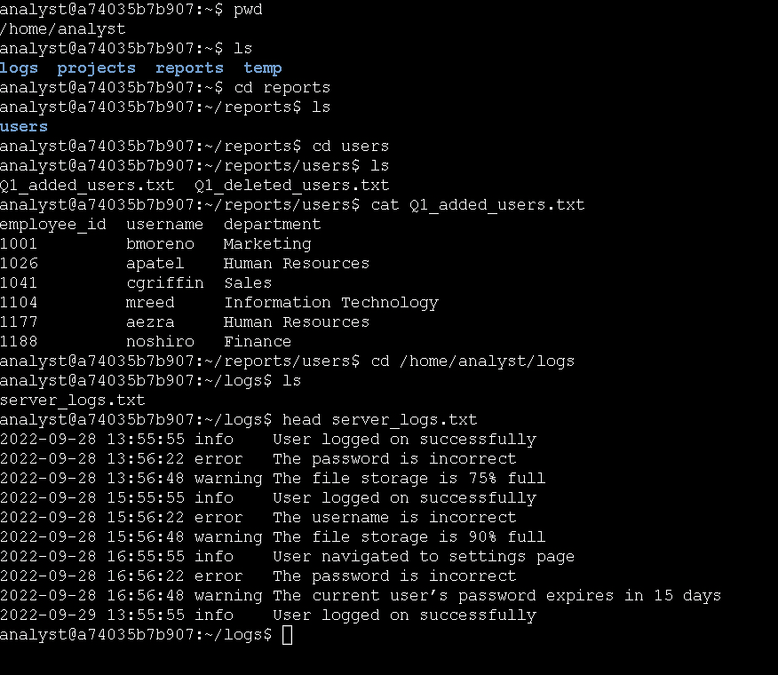

# Technical Exercise: Linux File System Navigation & Log Triage

Activity: Find files with Linux commands
Environment: Linux Bash Shell  
Role Context: Security Analyst / Incident Responder  
Tools Utilized: pwd, ls, cd, cat, head  

## Executive Summary
My job as a cybersecurity analyst, it is essential I have the foundational skills needed to access remote Linux servers that lack a graphical user interface (GUI) to respond to security incidents or conduct routine audits. With this practical exercise, I demonstrated and built my proficiency in navigating the Linux file system, locating critical files, and extracting relevant data directly from the command line. These skills are foundational for my daily tasks, such as reviewing user access reports, triaging system logs, and investigating unauthorized access.

---

## 1. Environment Reconnaissance
Before investigating any files, I needed to establish my current location within the file system and understand the immediate directory structure.

*   Action: I identified my current working directory.
    *   Command: pwd
    *   Outcome: The shell returned /home/analyst, confirming my starting location.
*   Action: I listed the contents of the current directory.
    *   Command: ls
    *   Outcome: The shell displayed the available files and subdirectories, which included the reports and logs directories.

---

## 2. Navigating to Target Directories
In incident response, I often need to move through nested directory structures to locate specific evidence, configuration files, or logs.

*   Action: I changed my working directory to the reports folder.
    *   Command: cd /home/analyst/reports
*   Action: I listed the subdirectories to locate user and system data.
    *   Command: ls
    *   Outcome: The shell displayed the available subdirectories, including users and logs.

---

## 3. Analyzing User Access Reports
During an access review or unauthorized access investigation, I need to quickly read through user provisioning files to verify account details and permissions.

*   Action: I navigated to the users subdirectory.
    *   Command: cd users
*   Action: I read the contents of the Q1 user addition report.
    *   Command: cat Q1_added_users.txt
    *   Outcome: The full contents of the text file were printed to my terminal. 
*   Analysis: By reviewing the output, I successfully located the record for the username aezra and identified their associated department. This step demonstrated my ability to quickly extract specific user attributes from raw text files during an audit.

---

## 4. Triage System Logs
When investigating an alert, I rarely need to read a massive log file all at once. Reviewing the most recent entries is my standard first step in triage to avoid flooding the terminal.

*   Action: I navigated to the logs directory.
    *   Command: cd /home/analyst/logs
*   Action: I identified the available log files.
    *   Command: ls
    *   Outcome: The directory contents were displayed, revealing the target log file.
*   Action: I displayed only the first 10 lines of the log file to check recent activity.
    *   Command: head -n 10 server_logs.txt 
    *   Outcome: The shell outputted exactly the first 10 lines of the file, allowing me to quickly review the log entries without overwhelming my terminal with thousands of lines of data.

---

## Professional Reflection & Key Takeaways
Navigating directories and reading files are basic Linux skills, I recognize important and use the are for remote incident response and log analysis.
1. Operating in Headless Environments: Most enterprise servers and cloud instances do not have a GUI. Through this practice, I reinforced that being able to confidently navigate the file system via the command line is mandatory for investigating compromised systems.
2. Efficient Log Triage: I learned that using head (or tail) instead of cat on massive log files prevents terminal lockups and allows me to quickly spot recent anomalies or verify log formats before running complex search queries.
3. Data Extraction: I noted that commands like cat are frequently paired with text-processing tools like grep. Mastering how to read files cleanly is my first step toward building pipelines that can parse thousands of lines of authentication logs to find unauthorized access attempts.

### 📸 Evidence: Finding Files with Linux Commands

*Figure 1: Screenshot demonstrating the use of Linux commands to locate files.*

---
*Note: This document outlines my hands-on practice and learning proficiency in foundational Linux file system navigation, log triage, and command-line data extraction skills required for cybersecurity operations.*