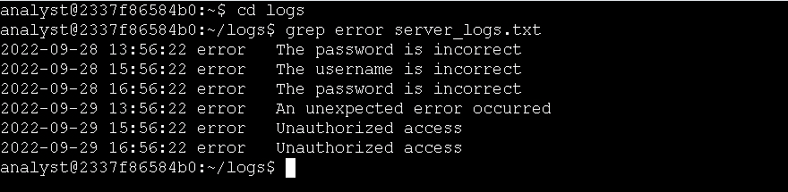
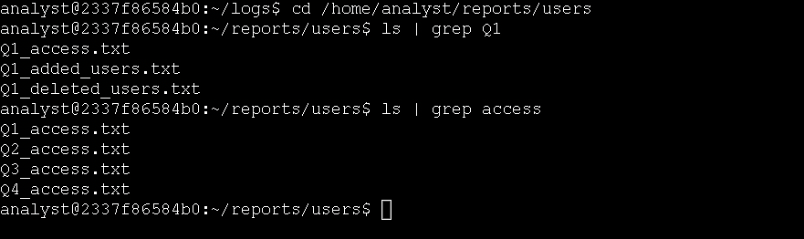
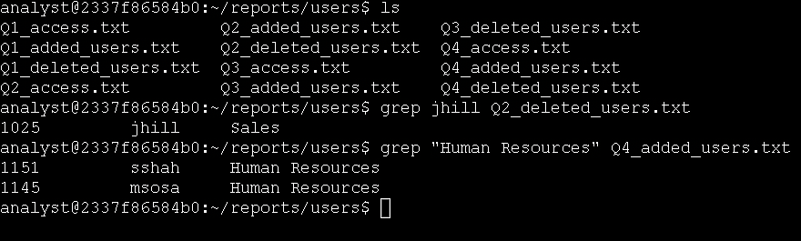

# Technical Exercise: Linux Text Processing & Log Filtering

Assessment Context: Scenario-Based Simulation (Google Cybersecurity Professional Certificate)  
Activity: Filter with grep  
Environment: Linux Bash Shell  
Role Assumed: Security Analyst / SOC Analyst  
Tools Utilized: grep, | (pipe operator), ls, cd  

> *Note: This document represents a hands-on practical activity where I assume the role of a SOC Analyst utilizing Linux text processing tools to extract targeted data from system logs.*

---

## Executive Summary
In cybersecurity, the ability to quickly separate critical signals from massive amounts of noise is a core competency. This exercise focused on my hands-on practice with the grep command and command-line piping to extract targeted data from system logs and user reports. By learning to chain commands together and filter raw text, I built the foundational proficiency needed to efficiently investigate alerts, audit user changes, and triage security events without manually sifting through thousands of lines of data.

---

## 1. Filtering Log Data for Errors
When reviewing server logs, reading every single line is inefficient. I needed to isolate only the entries that indicated a problem.

* Action: I navigated to the logs directory and filtered the server log for error messages.
  * Command: cd /home/analyst/logs followed by grep "error" server_logs.txt
  * Outcome: The terminal outputted only the specific lines containing the word "error", instantly stripping away all the routine informational noise and highlighting the exact issues I needed to investigate.

*Figure 1: Filtering server logs to isolate specific error messages.*

---

## 2. Piping Commands to Filter File Lists
Sometimes the goal isn't to search *inside* a file, but to find the file itself based on its name. I practiced combining commands to streamline this process.

* Action: I navigated to the user reports directory and filtered the directory listing to find specific quarterly files.
  * Command: cd /home/analyst/reports/users followed by ls | grep "Q1"
  * Outcome: By piping (|) the output of ls directly into grep, the shell returned only the filenames containing the string "Q1". This demonstrated how chaining commands creates a highly efficient, single-step workflow.

*Figure 2: Using the pipe operator to filter directory listings for specific quarterly files.*

---

## 3. Extracting Specific User Records
Auditing user accounts often requires hunting for specific usernames or departments within large provisioning files. 

* Action: I searched for a specific deleted user account.
  * Command: grep "jhill" Q2_deleted_users.txt
  * Outcome: The shell isolated and displayed the exact line containing the username "jhill", confirming their removal from the system.

*Figure 3: Extracting specific user records and department data using grep.*

* Action: I searched for all new hires in a specific department.
  * Command: grep "Human Resources" Q4_added_users.txt
  * Outcome: The command successfully listed every user entry associated with the Human Resources department, allowing me to quickly verify the Q4 onboarding records.

---

## Professional Reflection & Key Takeaways
This exercise was a major stepping stone in my Linux proficiency, specifically regarding how to make the shell do the heavy lifting for me.

1. The Power of Piping: Learning to use the pipe operator (|) changed how I approach the command line. Instead of running a command, copying the output, and searching it manually, I can now chain tools together to get immediate, filtered results.
2. Signal vs. Noise: In a real Security Operations Center (SOC), logs are overwhelmingly large. Practicing grep reinforced the importance of knowing exactly what string to search for to cut through the noise and find the actionable intelligence.
3. Foundation for Advanced Parsing: While grep is powerful on its own, I recognize that mastering it is the prerequisite for learning more advanced text-processing tools like awk and sed, which I will need for complex log parsing and automation scripts in the future.

---

*Note: This document outlines my hands-on practice and learning proficiency in Linux text processing, command-line piping, and targeted data extraction skills required for cybersecurity operations.*
