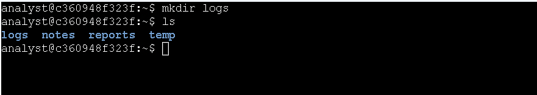
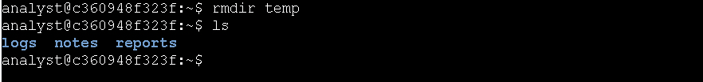
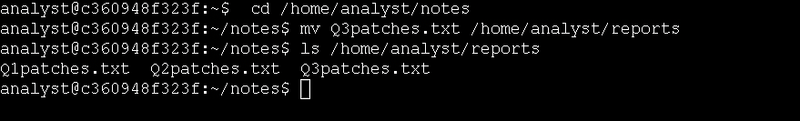
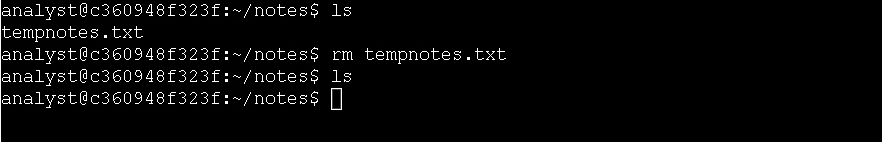
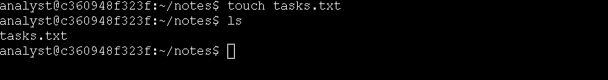
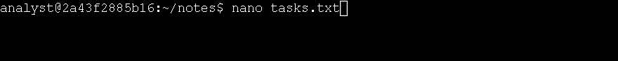
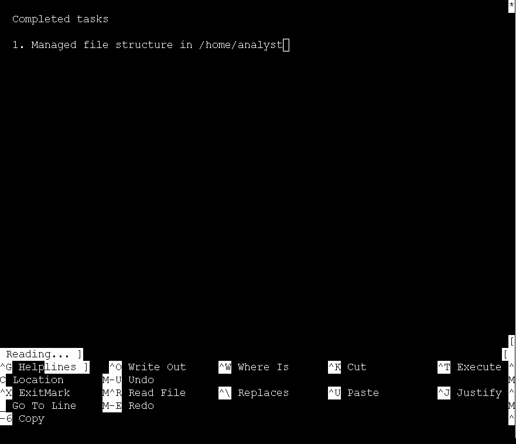
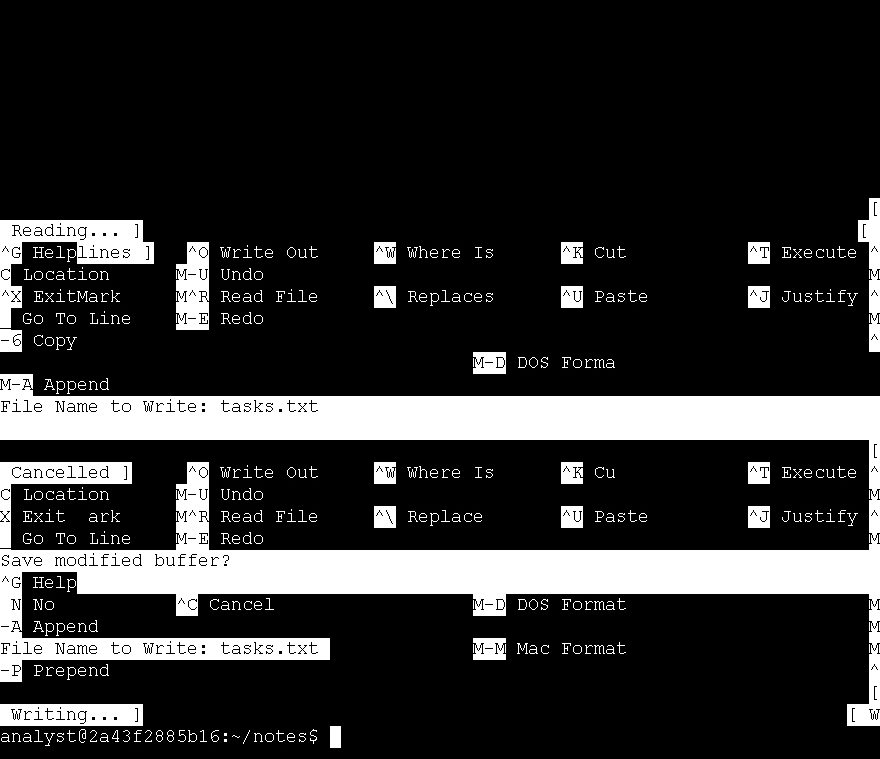
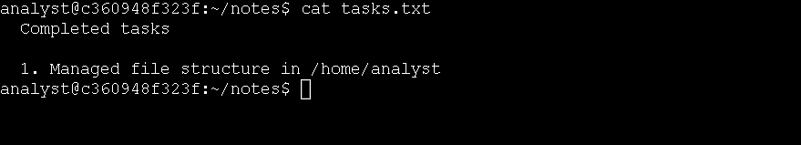

# Technical Exercise: Linux File Management & Documentation

Assessment Context: Scenario-Based Simulation (Google Cybersecurity Professional Certificate)  
Activity: Manage files with Linux commands  
Environment: Linux Bash Shell  
Role Assumed: Security Analyst / Incident Responder  
Tools Utilized: mkdir, rmdir, rm, mv, touch, nano, cat, ls, cd  

> *Note: This document represents a hands-on practical activity where I assume the role of an Incident Responder managing the Linux file lifecycle to maintain clean investigation directories and clear audit trails.*

---

## Executive Summary
In cybersecurity investigations, a disorganized file system can lead to lost evidence, failed audits, and unnecessary operational delays. This exercise focused on my hands-on practice with Linux file lifecycle management creating, moving, removing, and editing files directly from the command line. By structuring my workspace, removing stale data, and maintaining accurate documentation through the nano text editor, I built the proficiency needed to keep investigation directories clean, maintain clear audit trails, and operate efficiently without a graphical interface.

---

## 1. Creating a New Directory
Before organizing files, I needed to establish a dedicated location for future log storage within my current working directory.

* Action: I created a new logs subdirectory.
  * Command: mkdir logs
  * Outcome: I ran ls to confirm the logs directory was successfully created alongside the existing notes and reports directories.

*Figure 1: Creating a dedicated logs subdirectory using the mkdir command.*

---

## 2. Removing a Stale Directory
Keeping unused directories out of the working environment reduces clutter and maintains a clean, organized file structure.

* Action: I removed the empty temp directory.
  * Command: rmdir temp
  * Outcome: I verified with ls that the directory was completely removed, leaving only logs, notes, and reports.

*Figure 2: Removing an empty stale directory using the rmdir command.*

---

## 3. Moving a File
During investigations, files often need to be moved between staging areas and final report folders. I practiced moving patch documentation to its proper reporting location.

* Action: I navigated to the notes directory and moved the Q3patches.txt file to the reports directory.
  * Command: cd /home/analyst/notes followed by mv Q3patches.txt /home/analyst/reports/
  * Outcome: I ran ls /home/analyst/reports to confirm the file was successfully relocated alongside the other quarterly patch files.

*Figure 3: Relocating patch documentation to the proper reports directory using the mv command.*

---

## 4. Removing an Unused File
To maintain a clean workspace, I needed to delete temporary files that were no longer needed.

* Action: I removed the tempnotes.txt file from the notes directory.
  * Command: rm tempnotes.txt
  * Outcome: Running ls confirmed the file was successfully deleted, leaving the notes directory completely empty.

*Figure 4: Deleting an unused temporary file using the rm command.*

---

## 5. Creating a New Documentation File
I needed a new file to track the changes I was making to the directory structure.

* Action: I created an empty file named tasks.txt in the current notes directory.
  * Command: touch tasks.txt
  * Outcome: I verified with ls that the new tasks.txt file was successfully created.

*Figure 5: Creating a new empty documentation file using the touch command.*

---

## 6. Editing and Verifying the File with Nano
Finally, I needed to populate the new file with an audit log of the tasks I had just completed and verify the save.
* Action: I opened the file in nano to begin editing.
  * Command: nano tasks.txt
  * Outcome: The nano text editor opened in the terminal, ready for input.

*Figure 6: Opening the tasks.txt file in the nano text editor.*

* Action: I typed the completed tasks documentation into the editor.

*Figure 7: Inputting the audit log of completed tasks into nano.*

* Action: I saved the changes and exited the editor.
  * Outcome: I pressed Ctrl+X to exit, confirmed the save by pressing Y, and pressed Enter to confirm the filename.

*Figure 8: Saving the changes and exiting the nano editor.*

* Action: I verified the contents of the saved file.
  * Command: cat tasks.txt
  * Outcome: After using clear to clean the terminal screen, I ran cat to display the contents and confirm my documentation was saved correctly.

*Figure 9: Verifying the saved contents of tasks.txt using the cat command.*

---

## Professional Reflection & Key Takeaways
Managing files from the command line might seem administrative, but in security operations, it directly impacts investigation speed and evidence integrity.

1. Choosing the Right Removal Command: I learned the difference between rmdir (for empty directories) and rm (for files). Using the appropriate command prevents accidental data loss and ensures safe file system management.
2. Efficient File Organization: I reinforced the importance of moving files to their proper locations (mv) and removing stale data (rm) to maintain a lean workspace. In a real incident response, this prevents accidental analysis of outdated data and reduces the risk of leaving sensitive temporary files exposed.
3. Terminal-Based Documentation: Using nano to document actions in real-time (like the tasks.txt log) is a critical habit. It creates an immediate, tamper-evident audit trail of exactly what was done during a shift or investigation, which I verified instantly using cat.

---

*Note: This document outlines my hands-on practice and learning proficiency in Linux file system management, CLI text editing, and operational documentation skills required for cybersecurity workflows.*