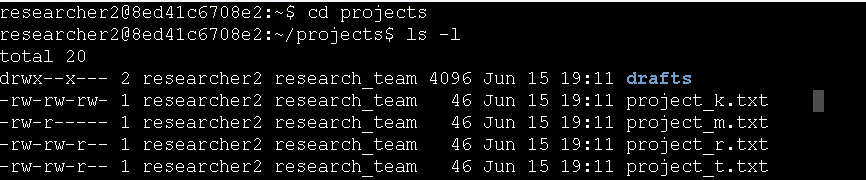
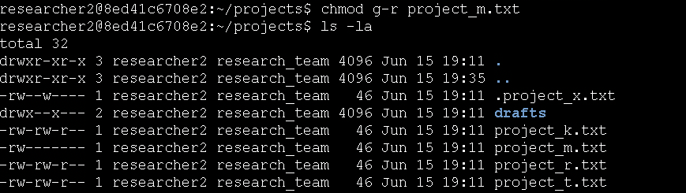
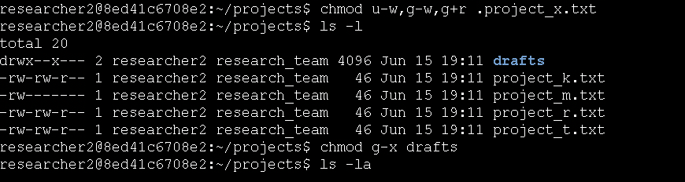
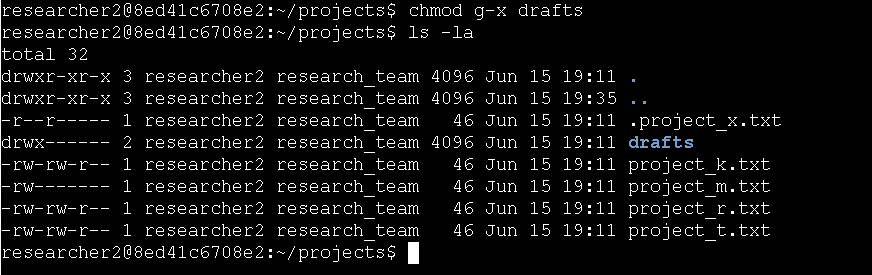

# Technical Exercise: Linux File Permissions & Authorization Management

Assessment Context: Scenario-Based Simulation (Google Cybersecurity Professional Certificate)  
Activity: Manage authorization  
Environment: Linux Bash Shell  
Role Assumed: Security Analyst  
Tools Utilized: chmod, ls -la, ls -l, cd  

> *Note: This document represents a hands-on practical activity where I assume the role of a Security Analyst enforcing the principle of least privilege through Linux file permission management.*

---

## Executive Summary
Enforcing the principle of least privilege is how we actually protect sensitive data from unauthorized access. During this exercise, I took on the role of a security analyst tasked with locking down the researcher2 user environment. I used the chmod command to analyze permission strings, strip away excessive access rights, and restrict sensitive directories. This hands-on work transformed my theoretical understanding of Linux authorization into practical skills, ensuring I can confidently secure research data against both group and public exposure.
---

## 1. Checking File and Directory Details
Before making any changes, I needed to understand the current permission state of all files in the projects directory, including hidden files.

* Action: I navigated to the projects directory and listed all files with detailed permission information.
  * Command: cd projects followed by ls -l
  * Outcome: The output showed the initial permission state of all files, revealing that several files had overly permissive settings that needed to be corrected.

*Figure 1: Reviewing the initial permission state of files in the projects directory.*

---

## 2. Changing File Permissions
I identified files with incorrect permissions and systematically removed unauthorized write access to strengthen security.

* Action: I removed write permissions for "other" users on project_k.txt.
  * Command: chmod o-w project_k.txt
  * Outcome: Running ls -l confirmed that the "other" write permission was successfully removed, preventing unauthorized external users from modifying the file.

*Figure 2: Removing write permissions for "other" users on project_k.txt.*

* Action: I restricted project_m.txt to remove group read permissions since it's a restricted file.
  * Command: chmod g-r project_m.txt
  * Outcome: I verified with ls -la that the group no longer had read access, ensuring only the owner could view this sensitive file.

*Figure 3: Restricting group read access on the sensitive project_m.txt file.*

---

## 3. Changing Permissions on a Hidden File
Hidden files often contain configuration or archived data that requires special protection. I needed to secure the .project_x.txt archived file.

* Action: I modified permissions on the hidden file so that both user and group can read but not write to it.
  * Command: chmod u-w,g-w,g+r .project_x.txt
  * Outcome: Running ls -l confirmed the file now had read-only access for user and group, preventing accidental or malicious modifications to the archived data.

*Figure 4: Securing the hidden archived file with read-only permissions for user and group.*

---

## 4. Changing Directory Permissions
Directories require execute permissions for access. I needed to restrict the drafts directory so only the owner (researcher2) could access it.

* Action: I removed execute permission for the group from the drafts directory.
  * Command: chmod g-x drafts
  * Outcome: I verified with ls -la that the directory permissions changed from drwxr-x--- to drwxr-----, ensuring only researcher2 could enter and access the contents of the drafts directory.
  
*Figure 5: Removing group execute permissions to lock down the drafts directory.*

---

## Professional Reflection & Key Takeaways
Managing file permissions is one of the most fundamental yet critical skills in Linux security administration.

1. Understanding Permission Strings: I learned to read and interpret the 10-character permission string (e.g., -rw-rw-r--) to quickly identify security gaps. Recognizing that the first character indicates file type, followed by user/group/other permissions, is essential for rapid security assessments.
2. Principle of Least Privilege: This exercise reinforced the importance of removing unnecessary permissions. By systematically removing write access for "other" users and restricting group read access on sensitive files, I practiced implementing the principle of least privilege that is core to cybersecurity.
3. Hidden Files Require Attention: I learned that hidden files (starting with a dot) are not inherently secure—they have permissions just like regular files and must be audited and protected with the same rigor.
4. Directory Execute Permissions: I now understand that the execute (x) permission on directories controls who can cd into them. Removing group execute from the drafts directory effectively locked out all group members, demonstrating how directory permissions control access to entire file structures.

---

*Note: This document outlines my hands-on practice and learning proficiency in Linux file permission management, authorization controls, and security hardening skills required for cybersecurity operations.*