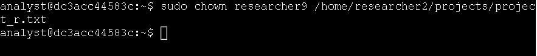

# Technical Exercise: Linux User & Group Management

Assessment Context: Scenario-Based Simulation (Google Cybersecurity Professional Certificate)  
Activity: Add and manage users with Linux commands  
Environment: Linux Bash Shell  
Role Assumed: Security Analyst 
Tools Utilized: sudo, useradd, usermod, userdel, groupdel, chown  

> *Note: This document represents a hands-on practical activity where I assume the role of a System Administrator managing the complete lifecycle of Linux user accounts and enforcing access controls.*

---

## Executive Summary
If you don't know who has access to what, you cannot protect the system. Identity and Access Management (IAM) is the absolute foundation of system security. During this exercise, I managed the complete lifecycle of a Linux user entirely from the command line. From onboarding a new employee and transferring file ownership to modifying group memberships and executing a clean offboarding, I used elevated sudo privileges to enforce the principle of least privilege. This hands-on practice ensured I can confidently align system access strictly with an employee's current role.

---

## 1. Onboarding and Primary Group Assignment
When a new employee joins the Research department, they need a system account and the correct baseline access.

* Action: I created a new user account for the new employee.
  * Command: sudo useradd researcher9
  * Outcome: The system successfully created the user researcher9 along with their default home directory and personal group.

*Figure 1: Creating the new user account and default home directory.*

* Action: I assigned the user to their primary departmental group.
  * Command: sudo usermod -g research_team researcher9
  * Outcome: The user's primary group was updated to research_team, granting them the baseline permissions required for their role.

*Figure 2: Assigning the user to the primary research_team departmental group.*

---

## 2. Transferring File Ownership
As part of their onboarding, the new employee was assigned responsibility for a specific project file that previously belonged to another user.

* Action: I transferred ownership of the project file to the new employee.
  * Command: sudo chown researcher9 /home/researcher2/projects/project_r.txt
  * Outcome: The ownership of project_r.txt was successfully transferred from researcher2 to researcher9, giving the new employee full control over their assigned project data.

*Figure 3: Transferring file ownership to the newly onboarded employee.*

---

## 3. Updating Access with a Secondary Group
A few months later, the employee's role expanded, requiring them to collaborate with the Sales department while retaining their Research access.

* Action: I added the user to a supplementary group without removing their existing group memberships.
  * Command: sudo usermod -a -G sales_team researcher9
  * Outcome: The user was successfully added to the sales_team group. I made sure to use the -a (append) flag alongside -G, which is critical; without it, the command would have overwritten their existing secondary groups instead of adding to them.

*Figure 4: Safely appending the user to the secondary sales_team group.*

---

## 4. Offboarding and System Cleanup
A year later, the employee left the company. To maintain system security, I needed to completely remove their access and clean up the system.

* Action: I deleted the user account from the system.
  * Command: sudo userdel researcher9
  * Outcome: This command output the following message:
  "Userdel: Group researcher9 not removed because it is not the primary group of user researcher9" 
  This is because user and a group is automatically created and the user is the only member of that group and requires to be clean. The next step completes the job

  

*Figure 5: Deleting the user account to revoke system access.*

* Action: I deleted the user's personal group that was created during onboarding.
  * Command: sudo groupdel researcher9
  * Outcome: The orphaned group was successfully removed, keeping the system's group registry clean and preventing unused security groups from lingering on the network.

*Figure 6: Removing the orphaned personal group to maintain a clean system registry.*

---

## Professional Reflection & Key Takeaways
Managing users from the command line is a high-stakes task, as a single typo can accidentally lock out users or grant unintended access.

1. The Importance of the Append Flag: I learned firsthand why the -a flag in usermod -a -G is so critical. Forgetting to append when adding a secondary group will strip the user of all their other group memberships, which can cause immediate operational disruptions.
2. Complete Offboarding: I realized that deleting a user (userdel) doesn't always clean up everything. Deleting the user's personal group (groupdel) afterward is a necessary step to prevent "orphaned" groups from cluttering the system and creating potential security blind spots.
3. Principle of Least Privilege: By actively managing primary and secondary groups, I reinforced how Linux uses group membership to enforce the principle of least privilege. Users should only be in the groups necessary for their current job function, and those memberships must be updated the moment their role changes.

---

*Note: This document outlines my hands-on practice and learning proficiency in Linux user lifecycle management, group administration, and file ownership skills required for cybersecurity operations.*
