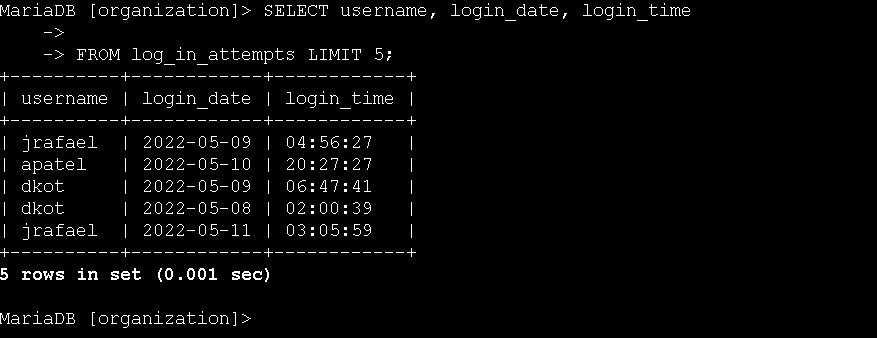
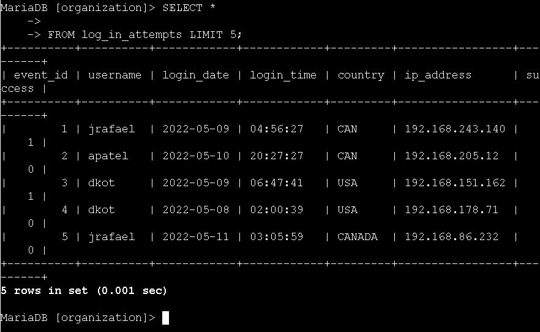
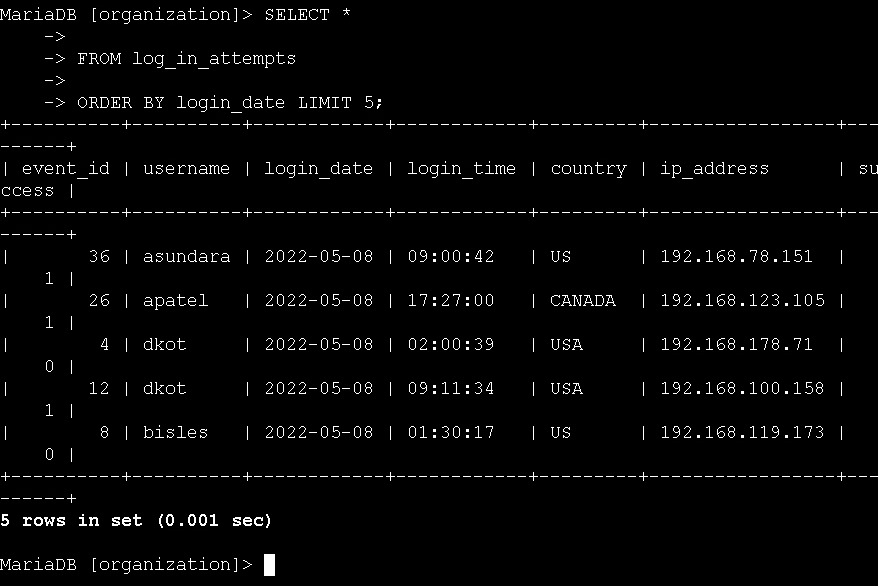
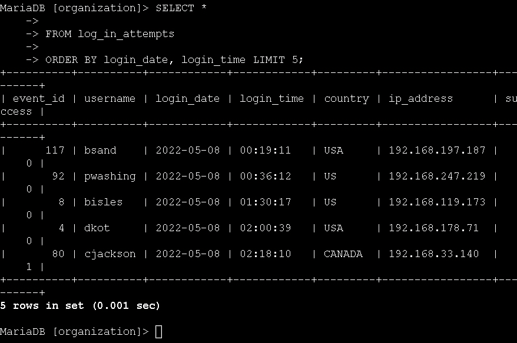

# Technical Exercise: SQL Query Fundamentals for Security Investigations

Assessment Context: Scenario-Based Simulation (Google Cybersecurity Professional Certificate)  
Activity: Perform a SQL query  
Environment: MariaDB Database (organization database)  
Role Assumed: Security Analyst / SOC Analyst  
Tools Utilized: SELECT, FROM, ORDER BY  

> *Note: All query outputs in screenshots were truncated using LIMIT 5 for brevity. In production environments, queries return full result sets.*

---

## Executive Summary
Extracting and analyzing data from databases is essential for investigating security incidents, monitoring user activity, and maintaining system integrity. During this exercise, I performed hands-on practice with fundamental SQL queries to retrieve and organize information from the organization's database. By querying the machines table to track device updates and the log_in_attempts table to investigate potential unauthorized access, I built the proficiency needed to conduct security audits, identify anomalies in login patterns, and ensure employee devices are properly maintained.

---

## 1. Retrieving Employee Device Data
To support the team's device update initiative, I needed to extract information about employee devices from the machines table.

* Action: I retrieved all columns from the machines table to get a complete view of device inventory.
  * Query:
   
    SELECT *
    FROM machines;
    
  * Outcome: The query returned all device information including device_id, operating_system, email_client, OS_patch_date, and employee_id, giving me a comprehensive view of the device fleet.

*Figure 1: Retrieving all columns to view the complete device inventory.*

* Action: I extracted specific columns to focus on email client configurations across devices.
  * Query:
   
    SELECT device_id, email_client
    FROM machines;
    
  * Outcome: The query returned only the device_id and email_client columns, allowing me to quickly identify which email clients are deployed across the organization.

*Figure 2: Extracting specific columns to analyze email client deployments.*

* Action: I retrieved operating system and patch date information to identify devices requiring updates.
  * Query:
   
    SELECT device_id, operating_system, OS_patch_date
    FROM machines;
    
  * Outcome: The query returned device IDs, their operating systems, and the last patch dates, enabling me to identify which devices are overdue for security updates.

*Figure 3: Querying OS and patch dates to identify devices needing security updates.*

---

## 2. Investigating Login Activity
To detect potential security threats, I analyzed login attempt data from the log_in_attempts table to identify unusual patterns such as unexpected geographic locations or login times outside business hours.

* Action: I queried the event_id and country columns to verify login locations.
  * Query:
   
    SELECT event_id, country
    FROM log_in_attempts;
    
  * Outcome: The query returned login event IDs and their geographic locations (CAN, USA, CANADA), allowing me to verify that logins originated from expected regions (United States, Canada, or Mexico).

*Figure 4: Verifying login locations to ensure they originate from expected regions.*

* Action: I extracted username, login_date, and login_time to check for after-hours access.
  * Query:
   
    SELECT username, login_date, login_time
    FROM log_in_attempts;
    
  * Outcome: The query returned login timestamps for each user, revealing potential suspicious activity such as logins at 04:56:27 and 03:05:59, which are outside typical business hours.
  

*Figure 5: Extracting timestamps to identify suspicious after-hours access.*

* Action: I retrieved all columns from the login_attempts table for a complete security audit.
  * Query:
   
    SELECT *
    FROM log_in_attempts;
    
  * Outcome: The query returned comprehensive login data including event_id, username, login_date, login_time, country, ip_address, and success status, providing the full context needed for incident investigation.

*Figure 6: Retrieving full login data for a comprehensive security audit.*

---

## 3. Ordering Login Attempts Data
To effectively analyze login patterns and identify suspicious sequences, I used the ORDER BY keyword to sort the login attempt data chronologically.

* Action: I sorted all login attempts by login_date to view activity in chronological order.
  * Query:
   
    SELECT *
    FROM log_in_attempts
    ORDER BY login_date;
    
  * Outcome: The query returned login attempts sorted by date, making it easy to track the sequence of login events and identify patterns on specific dates like 2022-05-08.

*Figure 7: Sorting login attempts by date to track event sequences.*

* Action: I refined the sorting by ordering results by both login_date and login_time for precise chronological analysis.
  * Query:
   
    SELECT *
    FROM log_in_attempts
    ORDER BY login_date, login_time;
    
  * Outcome: The query returned login attempts sorted first by date, then by time within each date, providing a precise timeline of events from 00:19:11 through 02:18:10 on 2022-05-08.

*Figure 8: Multi-column sorting to establish a precise chronological timeline of events.*

---

## Professional Reflection & Key Takeaways
SQL is one of the most powerful tools in a security analyst's toolkit, and this exercise reinforced why database querying skills are non-negotiable for cybersecurity professionals.

1. Precision in Data Retrieval: I learned that selecting specific columns (like device_id, email_client) instead of using SELECT * is more efficient when I only need certain information. This reduces network overhead and makes the results easier to analyze, which is critical when investigating large-scale security incidents.
2. Chronological Analysis is Critical: Using ORDER BY login_date, login_time taught me how essential proper sorting is for incident response. When investigating a breach, I need to reconstruct the exact timeline of events, and multi-column sorting gives me that precision.
3. Security Monitoring Through Queries: By querying login attempts for unusual patterns (like logins at 04:56 AM or from unexpected countries), I can proactively identify potential account compromises. This exercise showed me that SQL isn't just about retrieving data—it's about asking the right questions to uncover security threats.
4. Foundation for Advanced Analysis: These basic SELECT queries are the building blocks for more complex security analytics. Once I master filtering with WHERE clauses and joining multiple tables, I'll be able to correlate device vulnerabilities with login anomalies to detect sophisticated attack patterns.

---

*Note: This document outlines my hands-on practice and learning proficiency in SQL database querying, security data analysis, and investigative techniques required for cybersecurity operations.*
