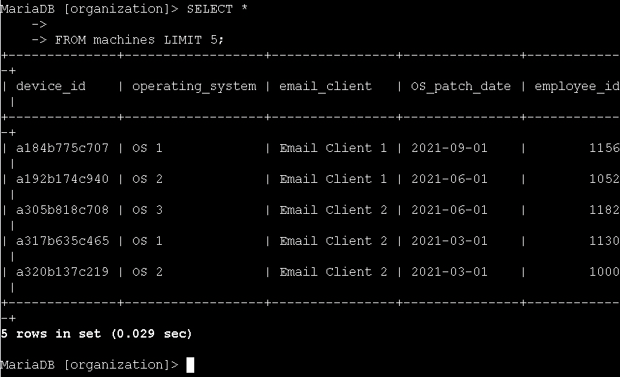
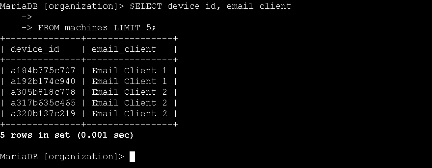
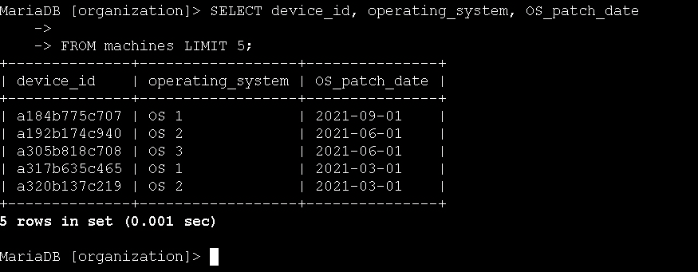
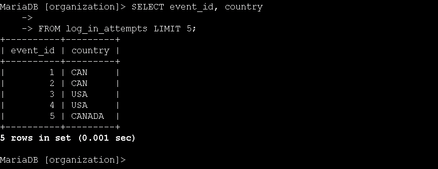

# Technical Exercise: SQL Query Fundamentals for Security Investigations

Assessment Context: Scenario-Based Simulation (Google Cybersecurity Professional Certificate)  
Activity: Perform a SQL query  
Environment: MariaDB Database (organization database)  
Role Assumed: Security Analyst / SOC Analyst  
Tools Utilized: SELECT, FROM, ORDER BY  

> *Note: All query outputs in screenshots were truncated using LIMIT 5 for brevity. In production environments, queries return full result sets.*

---

## Executive Summary
Extracting and analyzing data from databases is essential for investigating security incidents, monitoring user activity, and maintaining system integrity. During this exercise, I performed hands-on practice with fundamental SQL queries to retrieve and organize information from the organization's database. By querying the machines table to track device updates and the log_in_attempts table to investigate potential unauthorized access, I built the proficiency needed to conduct security audits, identify anomalies in login patterns, and ensure employee devices are properly maintained.

---

## 1. Retrieving Employee Device Data
To support the team's device update initiative, I needed to extract information about employee devices from the machines table.

* Action: I retrieved all columns from the machines table to get a complete view of device inventory.
  * Query:
   
    SELECT *
    FROM machines;
    
  * Outcome: The query returned all device information including device_id, operating_system, email_client, OS_patch_date, and employee_id, giving me a comprehensive view of the device fleet.

*Figure 1: Retrieving all columns to view the complete device inventory.*

* Action: I extracted specific columns to focus on email client configurations across devices.
  * Query:
   
    SELECT device_id, email_client
    FROM machines;
    
  * Outcome: The query returned only the device_id and email_client columns, allowing me to quickly identify which email clients are deployed across the organization.

*Figure 2: Extracting specific columns to analyze email client deployments.*

* Action: I retrieved operating system and patch date information to identify devices requiring updates.
  * Query:
   
    SELECT device_id, operating_system, OS_patch_date
    FROM machines;
    
  * Outcome: The query returned device IDs, their operating systems, and the last patch dates, enabling me to identify which devices are overdue for security updates.

*Figure 3: Querying OS and patch dates to identify devices needing security updates.*

---

## 2. Investigating Login Activity
To detect potential security threats, I analyzed login attempt data from the log_in_attempts table to identify unusual patterns such as unexpected geographic locations or login times outside business hours.

* Action: I queried the event_id and country columns to verify login locations.
  * Query:
   
    SELECT event_id, country
    FROM log_in_attempts;
    
  * Outcome: The query returned login event IDs and their geographic locations (CAN, USA, CANADA), allowing me to verify that logins originated from expected regions (United States, Canada, or Mexico).

*Figure 4: Verifying login locations to ensure they originate from expected regions.*

* Action: I extracted username, login_date, and login_time to check for after-hours access.
  * Query:
   
    SELECT username, login_date, login_time
    FROM log_in_attempts;
    
  * Outcome: The query returned login timestamps for each user, revealing potential suspicious activity such as logins at 04:56:27 and 03:05:59, which are outside typical business hours.