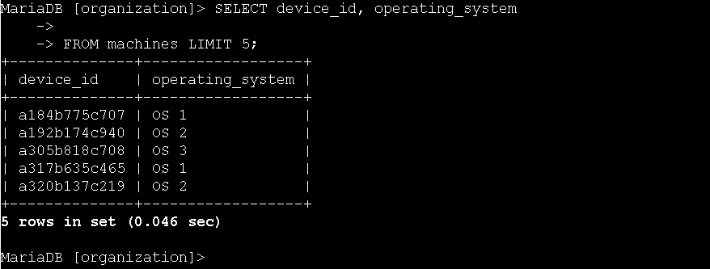
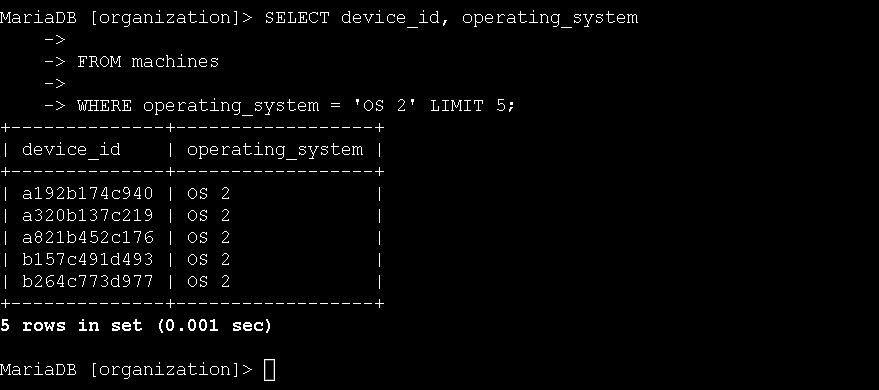
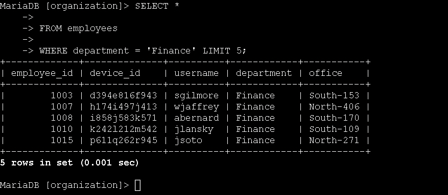
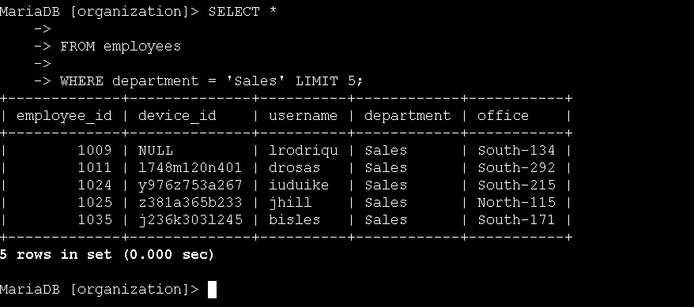
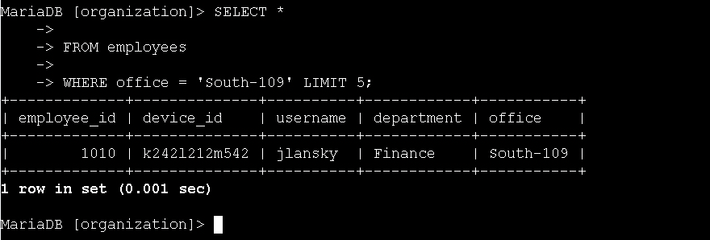
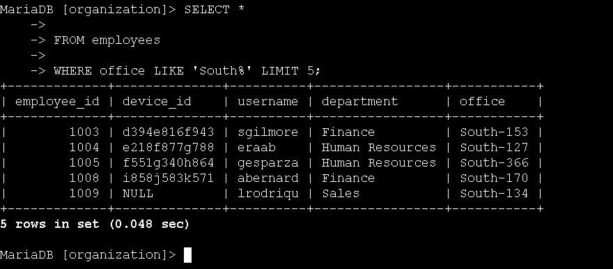

# Technical Exercise: SQL Filtering with WHERE and LIKE Clauses

Assessment Context: Scenario-Based Simulation (Google Cybersecurity Professional Certificate)  
Activity: Filter a SQL query  
Environment: MariaDB Database (organization database)  
Role Assumed: Security Analyst / SOC Analyst  
Tools Utilized: SELECT, FROM, WHERE, LIKE, OR  

> *Note: All query outputs in screenshots were truncated using LIMIT 5 for brevity. In production environments, queries return full result sets.*

---

## Executive Summary
In security operations, analysts rarely need to see all data in a database instead, we need to find specific indicators, affected assets, or users with targeted precision. This exercise focused on my hands-on practice with SQL filtering using WHERE and LIKE clauses to extract precisely the data needed for security tasks. By filtering machines requiring updates, identifying employees in specific departments for compliance notices, and locating users in affected office buildings, I built the proficiency needed to conduct efficient, targeted investigations without sifting through irrelevant data.

---

## 1. Listing All Organization Machines
To establish a baseline of the organization's device inventory, I started by retrieving all machines and their operating systems from the machines table.

* Action: I selected the device_id and operating_system columns from the machines table.
  * Query:
   
    SELECT device_id, operating_system
    FROM machines;
    
  * Outcome: The query returned a complete list of all devices with their operating systems, providing the foundational data needed to plan update deployments.

*Figure 1: Retrieving a complete baseline list of all devices and their operating systems.*

---

## 2. Filtering Machines Requiring Updates
The security team identified that machines running 'OS 2' require an urgent security update. I needed to filter the machine list to show only those affected systems.

* Action: I added a WHERE clause to filter for machines with operating_system = 'OS 2'.
  * Query:
   
    SELECT device_id, operating_system
    FROM machines
    WHERE operating_system = 'OS 2';
    
  * Outcome: The query returned only devices running OS 2, allowing the team to quickly identify and prioritize the machines requiring the security patch.

*Figure 2: Filtering the inventory to isolate only machines running OS 2 for urgent patching.*

---

## 3. Filtering Employees by Department
The organization needed to post privacy notices about handling confidential financial information in offices belonging to the Finance and Sales departments. I queried the employees table to identify affected personnel.

* Action: I filtered the employees table to return only those in the Finance department.
  * Query:
   
    SELECT *
    FROM employees
    WHERE department = 'Finance';
    
  * Outcome: The query returned all Finance department employees with their office numbers, enabling the team to post the required privacy notices in the correct locations.

*Figure 3: Isolating Finance department employees for compliance notice deployment.*

* Action: I modified the query to return employees in the Sales department.
  * Query:
   
    SELECT *
    FROM employees
    WHERE department = 'Sales';
    
  * Outcome: The query returned all Sales department employees with their office locations, completing the list of offices requiring the privacy notice.

*Figure 4: Isolating Sales department employees to complete the compliance notice list.*

---

## 4. Identifying Employees in Affected Buildings
The security team discovered issues with machines in the South building and needed to alert affected employees. I used both exact matching and pattern matching to locate the right personnel.

* Action: I filtered for the specific office 'South-109' where a machine issue was reported.
  * Query:
   
    SELECT *
    FROM employees
    WHERE office = 'South-109';
    
  * Outcome: The query returned the employee (jlansky from Finance) assigned to office South-109, allowing the team to send a targeted alert about the machine issue.

*Figure 5: Using exact matching to locate the specific employee in office South-109.*

* Action: I used the LIKE operator with a wildcard to find all employees in the South building.
  * Query:
   
    SELECT *
    FROM employees
    WHERE office LIKE 'South%';
    
  * Outcome: The query returned all employees whose office names start with 'South', including South-109, South-127, South-134, etc. This allowed the team to send a building-wide alert about the system-wide issue affecting the South building.

*Figure 6: Using the LIKE operator and wildcards to identify all personnel in the South building.*

---

## Professional Reflection & Key Takeaways
Filtering SQL queries is where database management transforms from simple data retrieval into powerful security investigation.

1. Precision Saves Time: Using WHERE operating_system = 'OS 2' instead of viewing all machines taught me how filtering dramatically reduces the noise in security investigations. When responding to a vulnerability affecting only specific systems, I can't waste time reviewing unaffected assets.
2. Pattern Matching is Powerful: The LIKE 'South%' query demonstrated how wildcards enable flexible searching. In security, this is invaluable for example, finding all usernames containing "admin", all IP addresses in a suspicious subnet, or all files with a specific extension.
3. Department-Based Filtering: Filtering by department (WHERE department = 'Finance') is directly applicable to compliance and access control audits. When investigating a data breach, I often need to focus on specific business units to understand the scope of exposure.
4. Building Complex Filters: This exercise laid the groundwork for combining multiple filters with AND and OR operators. In real investigations, I'll need queries like WHERE department = 'Finance' AND office LIKE 'South%' to pinpoint exactly who is affected by a security incident.

---

*Note: This document outlines my hands-on practice and learning proficiency in SQL filtering techniques, targeted data retrieval, and investigative querying skills required for cybersecurity operations.*