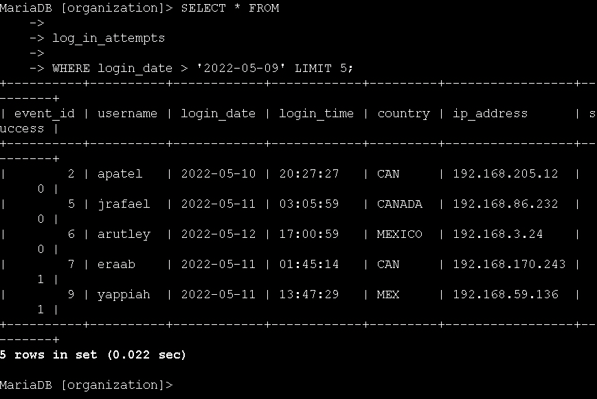
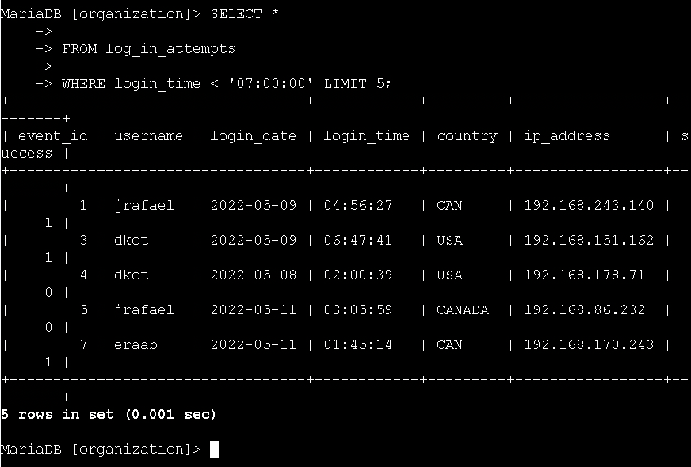
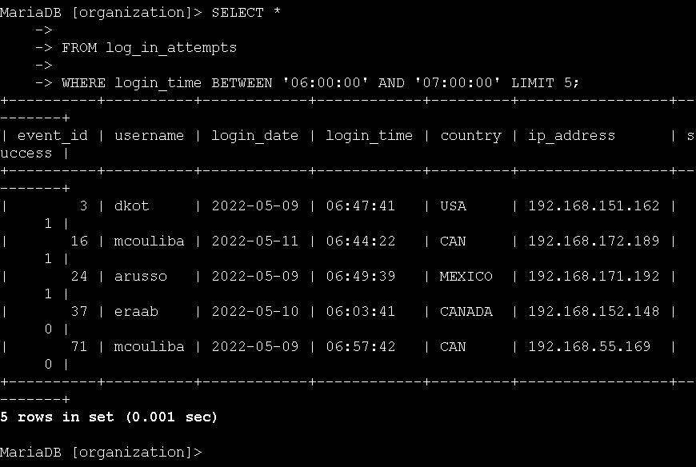
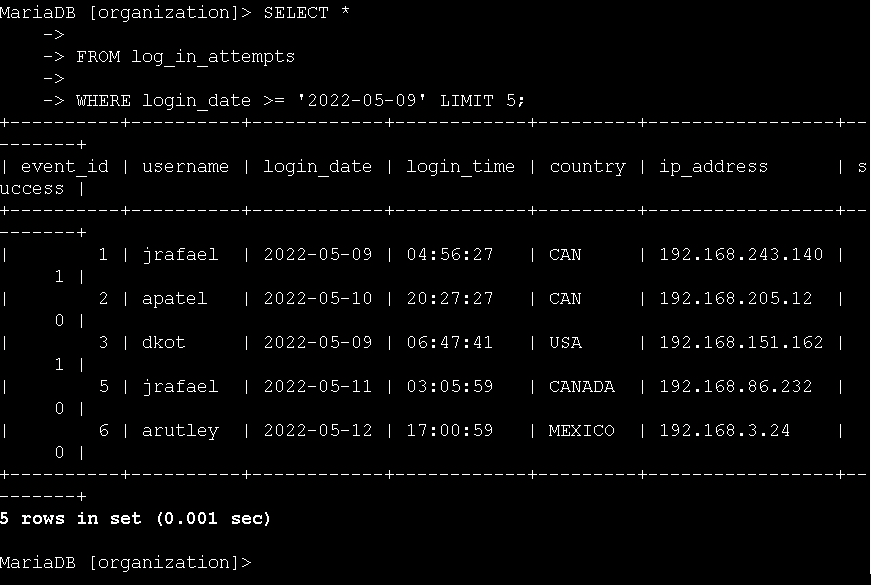
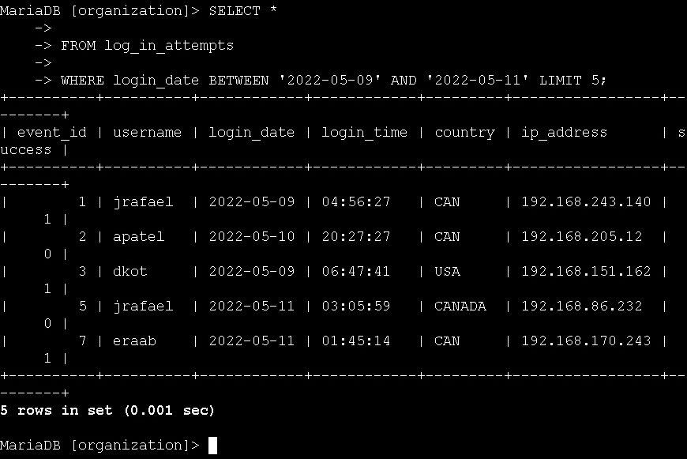
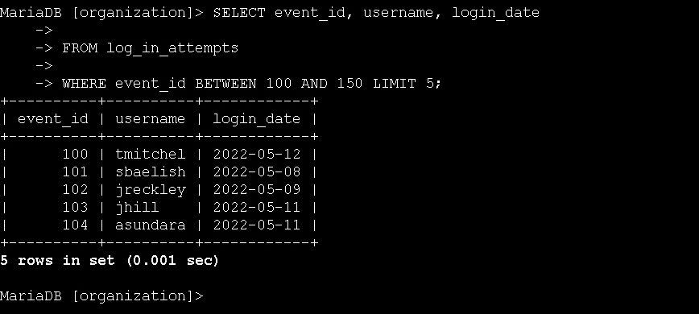
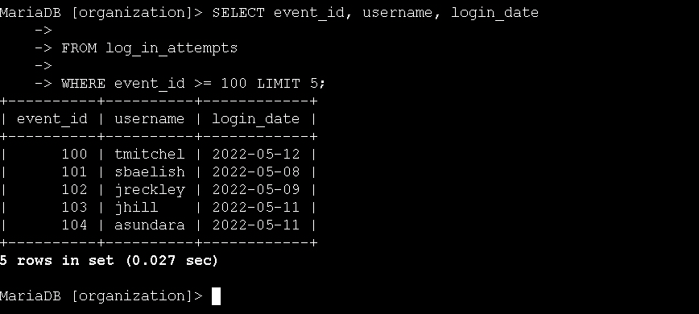

# Technical Exercise: Advanced SQL Filtering with Dates, Times, and Numeric Operators

Assessment Context: Scenario-Based Simulation (Google Cybersecurity Professional Certificate)  
Activity: Apply more filters in SQL  
Environment: MariaDB Database (organization database)  
Role Assumed: Security Analyst / SOC Analyst / Incident Responder  
Tools Utilized: SELECT, FROM, WHERE, BETWEEN, AND, >, >=, <  

> *Note: All query outputs in screenshots were truncated using LIMIT 5 for brevity. In production environments, queries return full result sets.*

---

## Executive Summary
In security incident response, time is critical and analysts must quickly isolate events within specific timeframes, identify off-hours activity, and filter by numeric identifiers to narrow down thousands of log entries. This exercise focused on my hands-on practice with advanced SQL filtering operators including comparison operators (>, >=, <) and range operators (BETWEEN and AND) to extract precise temporal and numeric data from security logs. By filtering login attempts by date ranges, identifying suspicious after-hours access, and isolating specific event IDs, I built the proficiency needed to conduct efficient timeline analysis and pinpoint security-relevant events during incident investigations.

---

## 1. Filtering Login Attempts by Date
To investigate a recent security incident, I needed to retrieve login attempts that occurred after a specific date. I practiced using both strict greater-than and greater-than-or-equal-to operators to control the date range precisely.

* Action: I filtered for login attempts made strictly after '2022-05-09'.
  * Query:
   
    SELECT *
    FROM log_in_attempts
    WHERE login_date > '2022-05-09';
    
  * Outcome: The query returned login events from May 10, 11, and 12, excluding May 9 itself. This is useful when I need to investigate activity that occurred *after* a known incident date.

*Figure 1: Filtering for login attempts strictly after the incident date.*

* Action: I modified the query to include logins from '2022-05-09' itself using the greater-than-or-equal-to operator.
  * Query:
   
    SELECT *
    FROM log_in_attempts
    WHERE login_date >= '2022-05-09';
    
  * Outcome: The query now included May 9 in the results, which is critical when the incident date itself needs to be part of the investigation timeline.

*Figure 2: Using >= to include the incident date in the investigation scope.*

---

## 2. Filtering Login Attempts Within a Date Range
To narrow the investigation scope, I needed to retrieve login attempts within a specific date window, excluding any events after May 11, 2022.

* Action: I used the BETWEEN operator to filter logins between '2022-05-09' and '2022-05-11'.
  * Query:
   
    SELECT *
    FROM log_in_attempts
    WHERE login_date BETWEEN '2022-05-09' AND '2022-05-11';
    
  * Outcome: The query returned only login attempts within the three-day window (May 9-11), providing a focused dataset for the incident investigation without extraneous data from later dates.

*Figure 3: Using BETWEEN to create a precise three-day investigation window.*

---

## 3. Investigating Off-Hours Login Activity
The security team needed to identify users logging in outside typical business hours (before 07:00:00). I filtered login attempts by time to detect potential unauthorized access or compromised accounts being accessed at unusual times.

* Action: I filtered for all login attempts made before 07:00:00 to identify early morning access.
* Query:
   
    SELECT *
    FROM log_in_attempts
    WHERE login_time < '07:00:00';
    
  * Outcome: The query returned logins occurring before 7 AM, including suspicious activity at 04:56:27 and 02:00:39. These off-hours logins warrant further investigation as potential security risks.

*Figure 4: Identifying all login attempts before 7 AM to detect suspicious off-hours access.*

* Action: I refined the query to focus on the specific window between 06:00:00 and 07:00:00.
  * Query:
   
    SELECT *
    FROM log_in_attempts
    WHERE login_time BETWEEN '06:00:00' AND '07:00:00';
    
  * Outcome: The query returned logins in the one-hour window just before business hours, helping identify users who consistently log in early—potentially legitimate early risers or indicators of account compromise.

*Figure 5: Narrowing the time window to identify consistent early-morning login patterns.*

---

## 4. Filtering Login Attempts by Event ID
To investigate specific login events by their unique identifiers, I filtered the log_in_attempts table using numeric comparison operators on the event_id column.

* Action: I retrieved login attempts with event_id greater than or equal to 100.
  * Query:
   
    SELECT event_id, username, login_date
    FROM log_in_attempts
    WHERE event_id >= 100;
    
  * Outcome: The query returned all events with IDs of 100 or higher, allowing me to focus on a specific range of logged events in the database.

*Figure 6: Filtering for event IDs 100 and above to isolate a specific batch of log entries.*

* Action: I refined the query to return only events with event_id between 100 and 150.
  * Query:
   
    SELECT event_id, username, login_date
    FROM log_in_attempts
    WHERE event_id BETWEEN 100 AND 150;
    
  * Outcome: The query returned a precise range of events (100-150), demonstrating how to isolate specific batches of log entries for detailed forensic analysis.

*Figure 7: Using BETWEEN to create a tight numeric range for forensic event analysis.*

---

## Professional Reflection & Key Takeaways
Filtering by dates, times, and numeric values is where SQL becomes a true incident response tool. These operators allow me to reconstruct attack timelines and identify anomalies with surgical precision.

1. Date vs. Time Filtering: I learned that filtering by login_date and login_time requires different approaches. Date filtering helps establish the scope of an incident (when did it happen?), while time filtering reveals behavioral patterns (are users logging in at unusual hours?).
2. Inclusive vs. Exclusive Ranges: Using > versus >= might seem minor, but in security investigations, excluding the incident start date by mistake could mean missing critical evidence. I now understand when to use each operator based on whether the boundary value should be included.
3. BETWEEN for Precision: The BETWEEN operator is invaluable for creating tight investigation windows. Whether I'm looking at a specific date range during a breach or a time window when suspicious activity occurred, BETWEEN eliminates the noise and focuses my analysis.
4. Numeric Filtering for Forensics: Filtering by event_id is essential when correlating logs across multiple systems or when investigating a specific batch of events. This skill directly translates to real-world scenarios where I need to isolate events by sequence numbers, port numbers, or error codes.

---

*Note: This document outlines my hands-on practice and learning proficiency in advanced SQL filtering techniques, temporal data analysis, and numeric range queries required for cybersecurity incident response.*