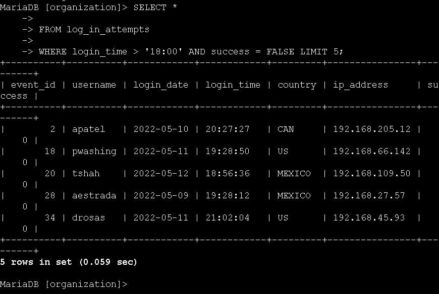
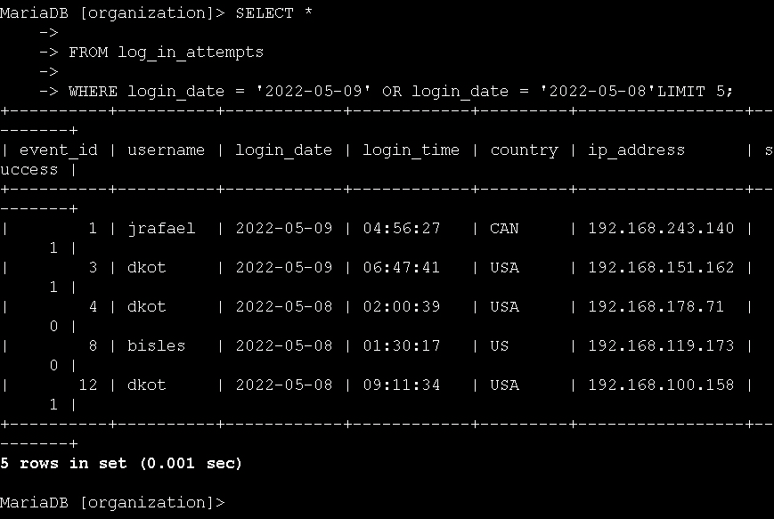
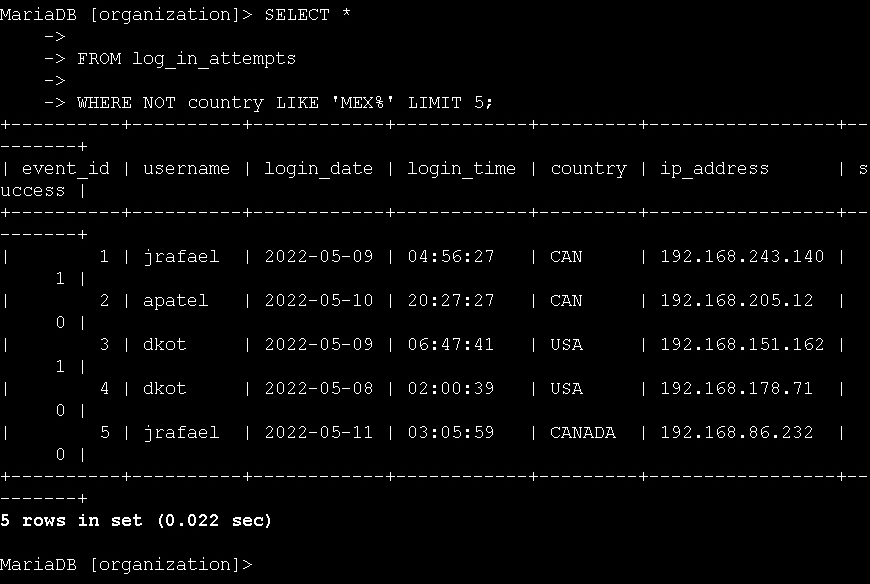
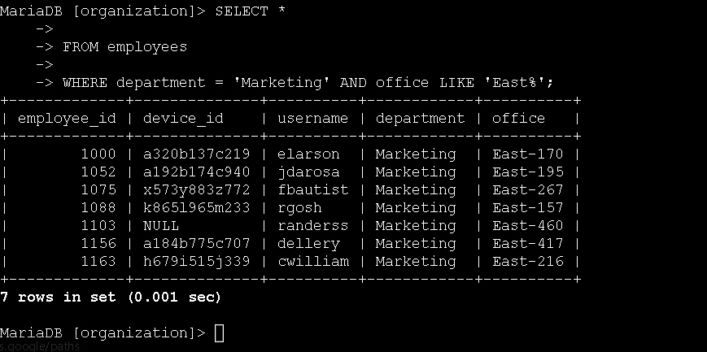
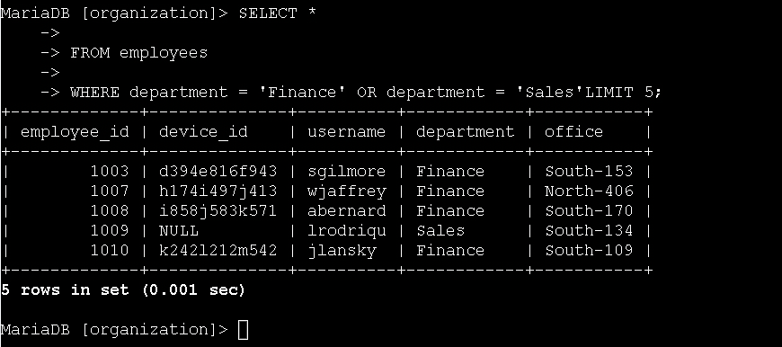
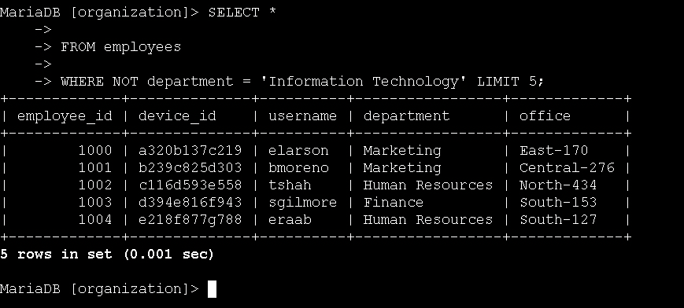

# Technical Exercise: Complex SQL Filtering with AND, OR, and NOT Operators

Assessment Context: Scenario-Based Simulation (Google Cybersecurity Professional Certificate)  
Activity: Filter a SQL query with Boolean operators  
Environment: MariaDB Database (organization database)  
Role Assumed: Security Analyst / SOC Analyst / Threat Hunter  
Tools Utilized: SELECT, FROM, WHERE, AND, OR, NOT, LIKE  

> *Note: All query outputs in screenshots were truncated using LIMIT 5 for brevity. In production environments, queries return full result sets.*

---

## Executive Summary
In threat hunting and incident response, isolating the exact data you need rarely depends on a single condition. Analysts must construct complex logic to filter out noise and pinpoint specific indicators of compromise. This exercise focused on my hands-on practice with Boolean operators (AND, OR, NOT) to build multi-condition SQL queries. By combining filters to isolate after-hours failed logins, exclude specific geographic regions, and target specific departmental assets, I developed the proficiency to write precise, logic-driven queries that directly support security investigations and IT operations.

---

## 1. Isolating After-Hours Failed Logins
To investigate potential brute-force attacks or compromised credentials, I needed to find login attempts that failed outside of standard business hours (after 18:00).

* Action: I combined a time filter with a success status filter using the AND operator.
  * Query:
   
    SELECT *
    FROM log_in_attempts
    WHERE login_time > '18:00' AND success = FALSE;
    
  * Outcome: The query successfully returned only the failed login attempts that occurred after 6 PM. This is a critical filter for identifying suspicious after-hours activity that warrants further investigation.

*Figure 1: Isolating failed login attempts occurring outside standard business hours.*

---

## 2. Retrieving Logins on Specific Dates
The security team needed to review all login activity surrounding a specific suspicious event that occurred over a two-day period.

* Action: I used the OR operator to retrieve logins from two distinct dates.
  * Query:
   
    SELECT *
    FROM log_in_attempts
    WHERE login_date = '2022-05-09' OR login_date = '2022-05-08';
    
  * Outcome: The query returned all login attempts from both May 8th and May 9th, providing the complete timeline of user activity needed to investigate the suspicious event.

*Figure 2: Using OR to combine login activity from two specific investigation dates.*

---

## 3. Excluding Specific Geographic Regions
To investigate potential unauthorized access, I needed to filter out all legitimate login attempts originating from Mexico to focus on foreign or unexpected IP geolocations.

* Action: I used the NOT and LIKE operators to exclude all countries starting with 'MEX'.
  * Query:
   
    SELECT *
    FROM log_in_attempts
    WHERE NOT country LIKE 'MEX%';
    
  * Outcome: The query successfully excluded entries like 'MEX' and 'MEXICO', returning only logins from other regions (like CAN and USA). This demonstrates how to quickly filter out known-safe or irrelevant data to focus on anomalies.

*Figure 3: Using NOT and LIKE to exclude known-safe geographic regions.*

---

## 4. Targeting Specific Departments and Locations
The IT team needed to update machines for employees in the Marketing department, but only for those located in the East building.

* Action: I combined an exact match filter with a wildcard pattern filter using AND.
* Query:
   
    SELECT *
    FROM employees
    WHERE department = 'Marketing' AND office LIKE 'East%';
    
  * Outcome: The query returned exactly the 7 Marketing employees located in East building offices (e.g., East-170, East-195). This precision prevents unnecessary updates to employees in other buildings.

*Figure 4: Combining exact match and pattern matching to target a specific department in a specific building.*

---

## 5. Retrieving Multiple Departments
A separate update was required for all employees in either the Finance or Sales departments.

* Action: I used the OR operator to include records from two different departments in a single query.
  * Query:
   
    SELECT *
    FROM employees
    WHERE department = 'Finance' OR department = 'Sales';
    
  * Outcome: The query successfully returned a combined list of all Finance and Sales employees, streamlining the process of gathering the required device information for the update.

*Figure 5: Using OR to combine multiple departmental records into a single result set.*

---

## 6. Excluding a Specific Department
The final update had already been completed for the Information Technology department, so I needed to generate a list of all employees *except* those in IT.

* Action: I used the NOT operator to exclude the Information Technology department from the results.
  * Query:
   
    SELECT *
    FROM employees
    WHERE NOT department = 'Information Technology';
    
  * Outcome: The query returned all employees across the organization while successfully filtering out the IT staff, ensuring the update team only targets the remaining departments.

*Figure 6: Using NOT to exclude completed departments from the deployment scope.*

---

## Professional Reflection & Key Takeaways
Mastering Boolean logic in SQL is what separates basic data retrieval from actual security analysis. 

1. **The Power of AND:** Using AND is essential for reducing false positives. In security, a single condition (like "failed login") is too broad. Combining it with another condition (like "after hours") creates a highly targeted alert that saves investigation time.
2. **Exclusion with NOT:** I learned that knowing what to *exclude* is just as important as knowing what to include. Using NOT with LIKE to filter out known-safe regions or departments is a standard practice in threat hunting to quickly surface anomal
3. **Combining Exact and Pattern Matching:ching:** Task 4 demonstrated how to mix = (exact match) with LIKE (pattern matching) in a single query. This flexibility is crucial when dealing with real-world data where some fields are standardized (like department names) and others are variable (like office number).
4. **Operational Efficiency:iency:** Writing precise queries directly impacts operational efficiency. By accurately filtering for specific departments or date ranges, I prevent the IT and security teams from wasting resources on irrelevant data or unnecessary system updates.

---

*Note: This document outlines my hands-on practice and learning proficiency in advanced SQL Boolean logic, multi-condition filtering, and targeted data extraction required for cybersecurity operations.*