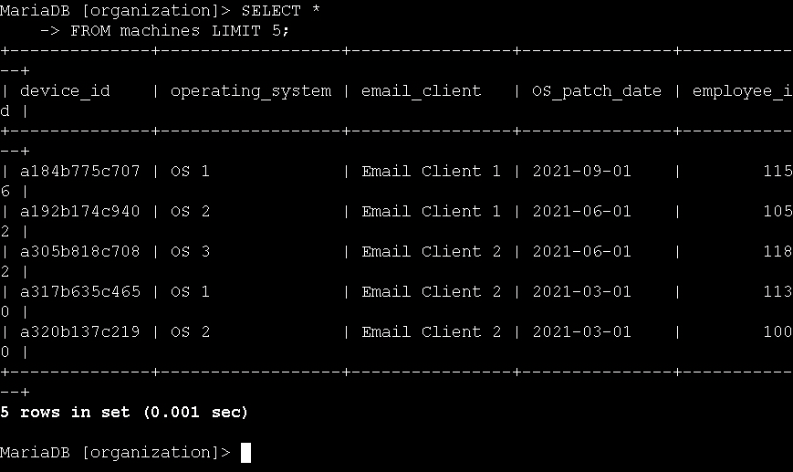
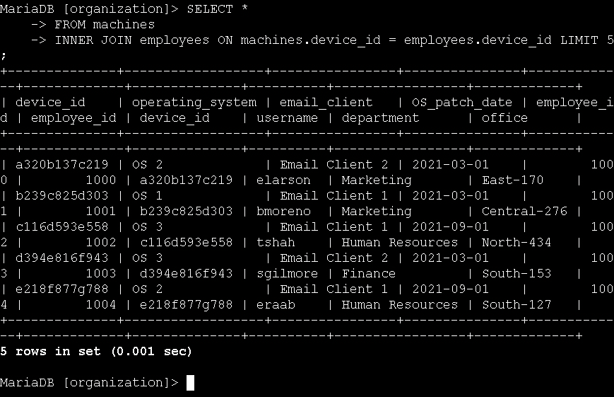
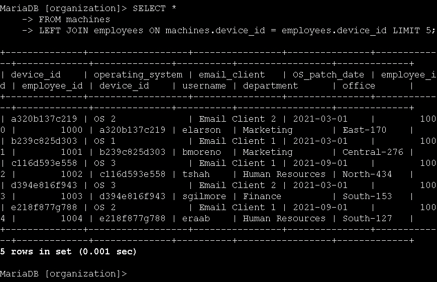
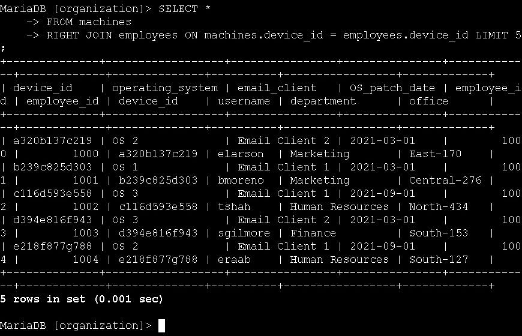
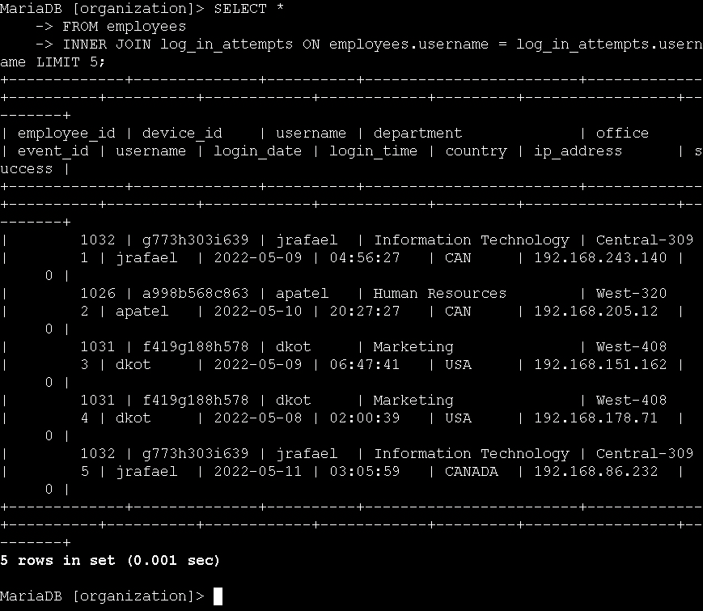

# Technical Exercise: SQL Joins for Security Investigations

Assessment Context: Scenario-Based Simulation (Google Cybersecurity Professional Certificate)  
Activity: SQL Joins for Security Investigations  
Environment: MariaDB Database (organization database)  
Role Assumed: Security Analyst / Incident Responder  
Tools Utilized: SELECT, FROM, INNER JOIN, LEFT JOIN, RIGHT JOIN, ON  

> *Note: All query outputs in screenshots were truncated using LIMIT 5 for brevity. In production environments, queries return full result sets.*

---

## Executive Summary
Critical security data rarely lives in a single table—employee records sit in HR databases, asset inventories in IT systems, and authentication logs in security tools. To investigate an incident effectively, an analyst must break down these data silos. This exercise focused on my hands-on practice with SQL joins (INNER, LEFT, and RIGHT) to correlate disparate datasets. By linking the machines, employees, and log_in_attempts tables, I built the proficiency to map specific users to their physical devices and trace their login activity—a fundamental skill for reconstructing attack timelines and conducting thorough incident response.

---

## 1. Matching Employees to Their Machines
To understand the organization's asset landscape, I needed to link the physical machines to the employees assigned to them. Both the machines and employees tables shared a common device_id column, making it the perfect key for joining.

* Action: I first queried the machines table to understand its structure and data.
  * Query:
   
    SELECT *
    FROM machines;
    
  * Outcome: The query returned the raw machine data, including device IDs, operating systems, and patch dates, establishing the baseline for the join.

*Figure 1: Reviewing the raw machines table structure before performing the join.*

* Action: I performed an inner join to connect the machines and employees tables on the device_id column.
  * Query:
   
    SELECT *
    FROM machines
    INNER JOIN employees ON machines.device_id = employees.device_id;
    
  * Outcome: The query successfully returned only the records where a machine was actively assigned to an employee. This inner join filtered out any unassigned assets, giving me a precise list of active user-device pairings.

*Figure 2: Using INNER JOIN to match employees with their assigned machines.*

---

## 2. Identifying Unassigned Assets and Users
During an audit, it is just as important to find what is *missing* as it is to find what is present. I needed to identify machines that had no user assigned to them, as well as users who had no machine assigned.

* Action: I executed a left join to return all records from the machines table, along with any matching employee data.
  * Query:
   
    SELECT *
    FROM machines
    LEFT JOIN employees ON machines.device_id = employees.device_id;
    
  * Outcome: The query returned every machine in the inventory. If a machine had no assigned employee, the employee columns returned as NULL. This is critical for identifying unassigned or orphaned devices that might pose a security risk.

*Figure 3: Using LEFT JOIN to identify machines without assigned employees.*

* Action: I executed a right join to return all records from the employees table, along with any matching machine data.
  * Query:
   
    SELECT *
    FROM machines
    RIGHT JOIN employees ON machines.device_id = employees.device_id;
    
  * Outcome: The query returned every employee in the database. If an employee had no machine assigned, the machine columns returned as NULL. This helps IT identify staff members who need hardware provisioned.
  

*Figure 4: Using RIGHT JOIN to identify employees without assigned machines.*

---

## 3. Correlating Login Attempts with Employee Records
To investigate the security incident, I needed to see exactly who was logging into the system. The log_in_attempts table contained usernames, but lacked department and office context.

* Action: I performed an inner join between the employees and log_in_attempts tables using the username column as the common key.
  * Query:
   
    SELECT *
    FROM employees
    INNER JOIN log_in_attempts ON employees.username = log_in_attempts.username;
    
  * Outcome: The query successfully merged the datasets, returning a comprehensive view that included the employee's ID, department, and office location alongside their login timestamps, IP addresses, and success statuses. This correlation is the backbone of incident response, allowing me to instantly trace a suspicious login back to a specific person and their physical location.

*Figure 5: Correlating login attempts with employee records to trace suspicious activity.*

---

## Professional Reflection & Key Takeaways
Mastering SQL joins transforms a security analyst from someone who merely looks at logs into someone who can reconstruct complex operational narratives.

1. Breaking Down Data Silos: I learned that the true power of a relational database lies in its relationships. By joining tables, I can enrich raw security logs (like an IP address or username) with contextual business data (like department and physical office location).
2. The Strategic Value of Outer Joins: While INNER JOIN is great for finding active matches, LEFT and RIGHT joins are vital for security audits. Finding "orphaned" machines (machines with no user) or unprovisioned users is a classic way to identify shadow IT or potential backdoors in an organization's infrastructure.
3. Choosing the Right Join Key: I practiced identifying the correct common column to link tables whether it was device_id for hardware or username for authentication. Choosing the wrong key results in a Cartesian product (massive, useless data), so understanding the database schema is just as important as knowing the SQL syntax.
4. Incident Response Efficiency: In a real breach, time is the enemy. Being able to write a single join query to map a malicious login to an employee's physical desk saves hours of manual cross-referencing between different IT systems.

---

*Note: This document outlines my hands-on practice and learning proficiency in SQL relational joins, data correlation, and investigative querying skills required for cybersecurity incident response.*