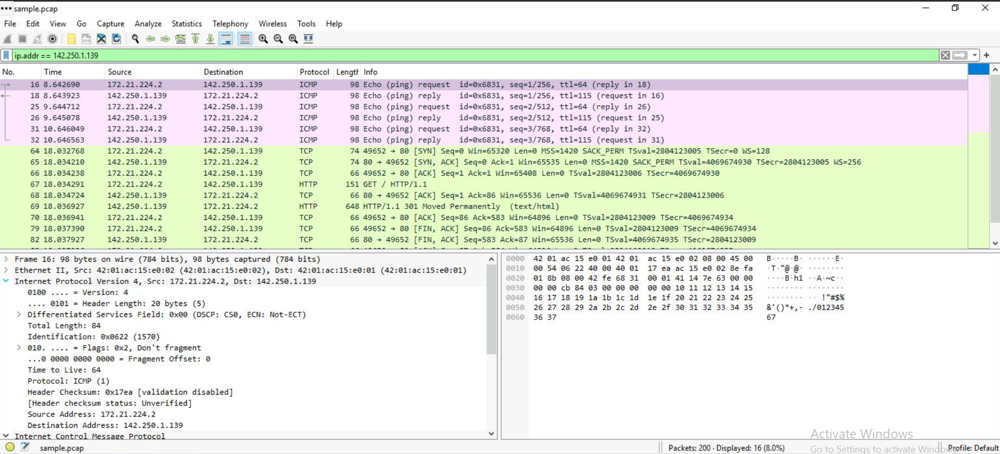
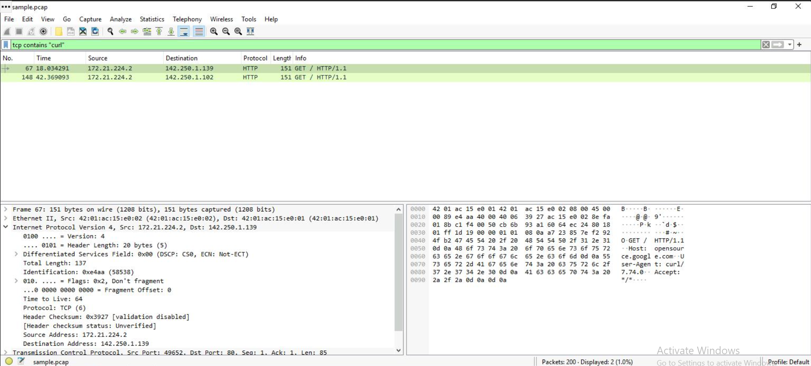

# Technical Exercise: Network Traffic Analysis with Wireshark

Assessment Context: Scenario-Based Simulation (Google Cybersecurity Professional Certificate)  
Activity: Wireshark Packet Capture Analysis and Filtering  
Environment: Windows Workstation with Wireshark GUI  
Role Assumed: Network Security Analyst  
Tools Utilized: Wireshark, Display Filters, Protocol Analysis  

---

## Executive Summary
As a security analyst investigating web traffic, I analyzed a network packet capture file containing data from a user connecting to a website. Using Wireshark's graphical interface and display filters, I examined protocol layers, identified source and destination IP addresses, analyzed DNS queries, and inspected TCP packet payloads to understand the network communication patterns. This exercise built my proficiency in visual packet analysis, directional filtering, and content-based searches essential for network forensics.

---

## 1. Explore Packet Capture Interface
Before applying filters, I needed to understand the overall structure and volume of the captured traffic.

* Action: I opened the sample.pcap file in Wireshark to review the captured network traffic.
  * Outcome: The packet list displayed 200 packets with columns for packet number, timestamp, source/destination IPs, protocol, length, and info. Color coding provided visual cues: light blue for DNS traffic, green for TCP/HTTP, and pink for ICMP packets.

---

## 2. Apply IP-Based Filters and Inspect Packet Layers
To focus on specific network communications, I needed to isolate traffic involving a particular IP address and examine its protocol structure.

* Action: I applied a display filter to isolate traffic for a specific IP address and examined the detailed packet structure.
  * Filter:
   
    ip.addr == 142.250.1.139
    
  * Outcome: The filter reduced the display to 16 packets (8.0% of total), showing only ICMP and TCP/HTTP traffic involving this IP. Double-clicking packets revealed the protocol stack: Frame → Ethernet II → IPv4 → TCP/ICMP. The Ethernet II layer showed MAC addresses (42:01:ac:15:e0:02), IPv4 layer showed source/destination IPs, and TCP layer showed ports, sequence numbers, and flags.

*Figure 1: Filtering by IP address and inspecting the nested protocol layers (Ethernet → IPv4 → TCP/ICMP).*

---

## 3. Filter by Source and Destination IP Addresses
Understanding traffic direction is critical for identifying whether a system is initiating connections or receiving them.

* Action: I applied directional filters to distinguish between outgoing and incoming traffic.
  * Filters:
   
    ip.src == 142.250.1.139    # Traffic FROM this IP
    ip.dst == 142.250.1.139    # Traffic TO this IP
    
  * Outcome: The ip.src filter showed packets originating from 142.250.1.139, while ip.dst showed packets sent to that address. This directional filtering is essential for understanding traffic flow during incident investigation.

---

## 4. Filter by MAC Address
Sometimes investigations require looking at the data link layer rather than the network layer, especially when dealing with ARP spoofing or local network issues.

* Action: I filtered traffic by Ethernet MAC address to isolate all communications from a specific network interface.
  * Filter:
   
    eth.addr == 42:01:ac:15:e0:02
    
  * Outcome: The filter displayed all packets involving this MAC address regardless of IP protocol. Inspecting the Ethernet II subtree confirmed the MAC address appeared as either source or destination. The IPv4 subtree showed Time to Live (TTL) values and protocol types (TCP/ICMP) carried within the IP packets.

---

## 5. Analyze DNS Traffic
DNS queries often reveal which external resources a system is attempting to contact, making them valuable for reconnaissance during investigations.

* Action: I filtered UDP port 53 traffic to examine DNS queries and responses.
  * Filter:
   
    udp.port == 53
    
  * Outcome: The DNS query packets revealed the domain name being resolved (opensource.google.com). Response packets contained the resolved IP addresses in the Answers section. This demonstrates how DNS traffic can reveal which external resources a system is attempting to contact.

---

## 6. Inspect TCP Traffic and Payload Data
To understand the actual content of web communications, I needed to inspect HTTP traffic and search for specific strings within packet payloads.

* Action: I filtered TCP port 80 traffic and searched for specific text in packet payloads.
  * Filters:
   
    tcp.port == 80              # HTTP traffic
    tcp contains "curl"         # Packets containing this text
    
  * Outcome: The tcp.port == 80 filter displayed HTTP web traffic including TCP handshakes (SYN, SYN-ACK, ACK) and HTTP GET requests. The tcp contains "curl" filter narrowed results to 2 packets (1.0% of total) showing HTTP/1.1 GET requests with User-Agent: curl/7.74.0 in the payload. The hex/ASCII view revealed the complete HTTP request headers including Host, User-Agent, and Accept fields.

*Figure 2: Using content-based filtering to locate HTTP GET requests containing the curl User-Agent string.*

---

## Key Visual Evidence: Filter Comparison

*Side-by-side comparison of Wireshark filtering techniques:*

| IP Address Filter (ip.addr == 142.250.1.139) | TCP Payload Filter (tcp contains "curl") |
|------------------------------------------------------|------------------------------------------------|
| Shows ICMP ping requests/replies and TCP handshake | Shows HTTP GET requests with curl User-Agent |
| Displays protocol layers: Ethernet → IPv4 → ICMP/TCP | Displays HTTP/1.1 headers in ASCII/hex format |
| 16 packets displayed (8.0%) | 2 packets displayed (1.0%) |

---

## Professional Reflection & Key Takeaways
This exercise demonstrated the power of Wireshark's graphical interface for visual packet analysis and forensic investigation. By systematically applying different filter types and inspecting protocol layers, I developed practical skills in network traffic analysis that complement command-line tools like tcpdump.

1. Display Filters vs. Capture Filters: Wireshark display filters (ip.addr, tcp.port, udp.port) allow post-capture analysis without losing data, unlike tcpdump capture filters.

2. Protocol Layer Inspection: Each packet contains nested protocol layers (Ethernet → IP → TCP/UDP → Application). Understanding this hierarchy is critical for troubleshooting and security analysis.

3. Directional Filtering: Using ip.src and ip.dst separately provides clarity on traffic flow direction, essential for identifying command-and-control communications or data exfiltration.

4. Payload Analysis: The tcp contains operator enables content-based searches across packet payloads, useful for finding specific strings, commands, or indicators of compromise.

5. Color Coding: Wireshark's coloring rules provide instant visual classification of traffic types, allowing rapid identification of anomalies in large packet captures.

6. DNS Intelligence: DNS queries reveal which domains a system contacted, providing reconnaissance data even when the actual content is encrypted.

---

*Note: This document outlines my hands-on practice and learning proficiency in Wireshark packet analysis, display filtering, protocol inspection, and network forensics skills required for cybersecurity operations.*
