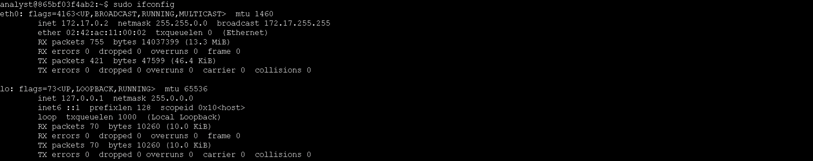
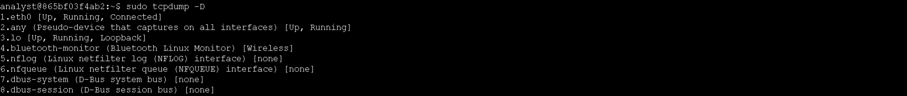
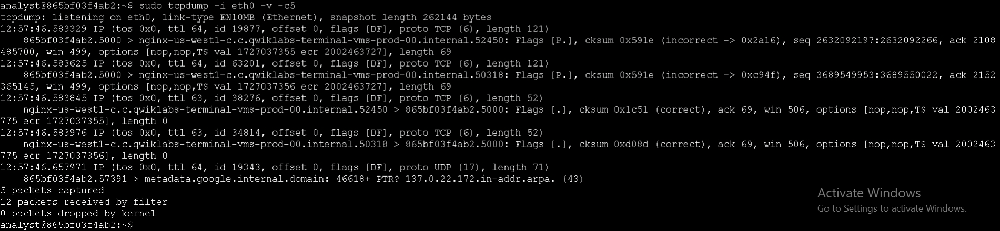
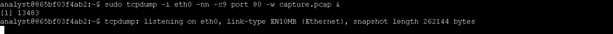
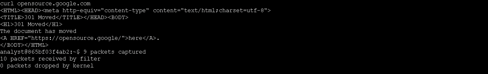
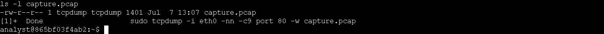
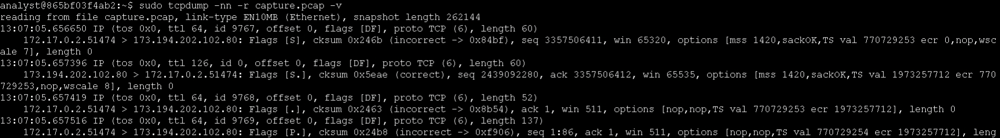
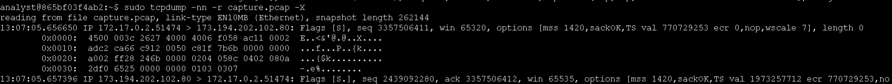

# Technical Exercise: Network Traffic Capture and Analysis with tcpdump

Assessment Context: Scenario-Based Simulation (Google Cybersecurity Professional Certificate)  
Activity: Network Packet Capture and Filtering  
Environment: Linux Virtual Machine (Ubuntu/Debian-based)  
Role Assumed: Network Security Analyst  
Tools Utilized: tcpdump, ifconfig, curl, ls  

---

## Executive Summary
As a network security analyst, I was tasked with capturing and analyzing live network traffic from a Linux virtual machine. Using tcpdump, I identified available network interfaces, captured specific HTTP traffic to a packet capture (pcap) file, and performed forensic analysis on the saved data to inspect packet headers and raw payloads. This exercise built my foundational competency in command-line packet inspection, filter syntax, and forensic workflow execution.

---

## 1. Identify Network Interfaces
To begin the capture process, I needed to identify the correct network interface to monitor.

* Action: I identified available network interfaces using ifconfig and tcpdump -D.
  * Commands: 
   
    sudo ifconfig
    sudo tcpdump -D
    
  * Outcome: The eth0 interface was identified as the primary Ethernet interface (172.17.0.2/16), with lo as the loopback interface. The tcpdump -D command confirmed 8 available capture interfaces, with eth0 designated for packet capture operations.

*Figure 1: Identifying the primary Ethernet interface and IP configuration using ifconfig.*

*Figure 2: Listing all available capture interfaces using tcpdump -D.*

---

## 2. Inspect Live Network Traffic
With the interface identified, I needed to verify that I could capture and inspect live packet data.

* Action: I captured and inspected live packet data from the eth0 interface using verbose output.
  * Command:
   
    sudo tcpdump -i eth0 -v -c5
    
  * Outcome: The command captured 5 packets with verbose details including TTL, flags, protocol type (TCP/UDP), sequence numbers, and acknowledgment flags. Traffic included DNS queries and TCP connections, demonstrating real-time network activity monitoring capability.

*Figure 3: Inspecting live network traffic with verbose output to view packet headers and flags.*

---

## 3. Capture Network Traffic to File
To perform forensic analysis later, I needed to save the captured packets to a file rather than just viewing them in the terminal.

* Action: I captured HTTP traffic (port 80) to a pcap file for forensic analysis, running tcpdump in the background.
  * Command:
   
    sudo tcpdump -i eth0 -nn -c9 port 80 -w capture.pcap &
    
  * Outcome: tcpdump was configured to capture 9 packets on port 80 with the -nn flag (no name resolution) and write to capture.pcap. The background process (PID 13483) was initiated successfully.

*Figure 4: Initiating a background packet capture filtered for port 80 and saving to a pcap file.*

* Action: I generated HTTP traffic using curl to populate the capture file.
  * Command:
   
    curl opensource.google.com
    
  * Outcome: The curl command generated HTTP/HTTPS traffic to opensource.google.com, resulting in a 301 redirect response. The capture recorded 9 packets with 10 received by filter and 0 dropped by kernel, confirming successful capture.

*Figure 5: Generating HTTP traffic using curl to populate the packet capture file.*

* Action: I verified the capture file was created successfully.
  * Command:
   
    ls -l capture.pcap
    
  * Outcome: The capture.pcap file (1401 bytes) was confirmed in /home/analyst/ with proper permissions, ready for analysis.

  
*Figure 6: Verifying the successful creation and size of the saved pcap file.*

---

## 4. Filter Captured Packet Data
With the traffic saved, I needed to perform deep forensic analysis on the captured data.

* Action: I analyzed the saved pcap file with verbose output to examine packet headers.
  * Command:
   
    sudo tcpdump -nn -r capture.pcap -v
    
  * Outcome: The command read the capture file and displayed detailed IP and TCP header information including TTL values (64, 126), flags (SYN, SYN-ACK, ACK, PSH), sequence/acknowledgment numbers, and window sizes. This revealed the TCP three-way handshake and subsequent data transmission.

*Figure 7: Performing verbose analysis of the saved pcap file to inspect TCP headers and handshake.*

* Action: I examined packet contents in hexadecimal and ASCII format for deep packet inspection.
  * Command:
   
    sudo tcpdump -nn -r capture.pcap -X
    
  * Outcome: The -X flag displayed both hexadecimal and ASCII representations of packet payloads, enabling inspection of raw data for malware signatures, protocol anomalies, or sensitive data exposure. TCP options (MSS, SACK, timestamps) were visible in the hex dump.

*Figure 8: Inspecting raw packet payloads in hexadecimal and ASCII format for deep forensic analysis.*

---

## Professional Reflection & Key Takeaways
This exercise demonstrated foundational network forensics skills using tcpdump on a Linux environment. By systematically identifying interfaces, capturing targeted HTTP traffic, and performing layered analysis of saved packet data, I developed practical competency in command-line packet inspection, filter syntax, and forensic workflow execution. These skills form the basis for real-world tasks such as incident response, malware analysis, and network intrusion detection.

1. Interface Selection: Proper interface identification using both ifconfig and tcpdump -D ensures captures target the correct network segment.
2. Name Resolution: The -nn flag disables DNS and port name resolution, preventing lookup delays and avoiding alerting potential threat actors during investigations.
3. Background Processing: Running tcpdump with & allows continuous capture while maintaining terminal access for generating test traffic or executing additional commands.
4. Forensic Analysis: The combination of -v (verbose) and -X (hex/ASCII) provides layered visibility from protocol headers to raw payload data essential for incident response and malware analysis.
5. Capture Filters: Using port 80 and -c (count) parameters enables targeted, bounded captures that focus on specific traffic types while managing file size.

---

*Note: This document outlines my hands-on practice and learning proficiency in network traffic analysis, packet capture, and forensic investigation techniques required for cybersecurity operations.*