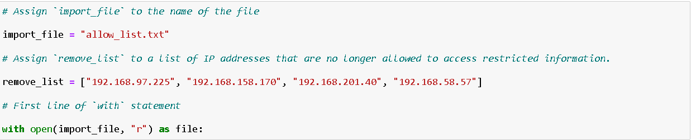
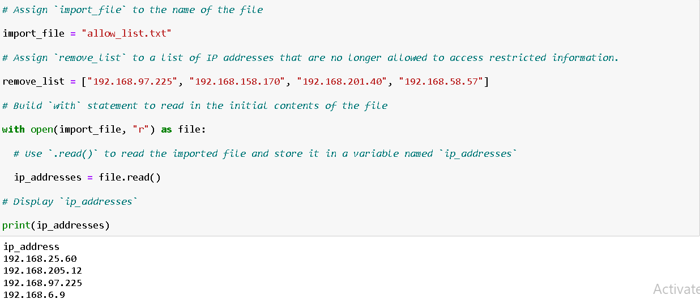
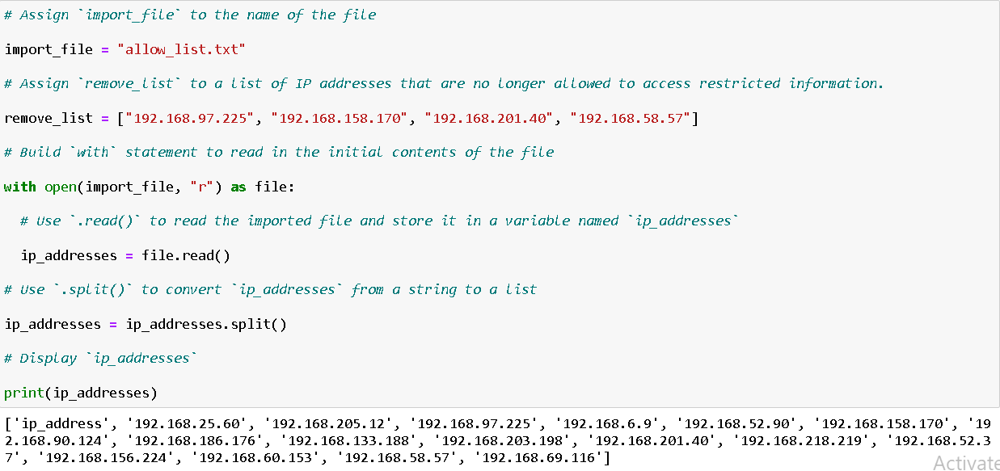
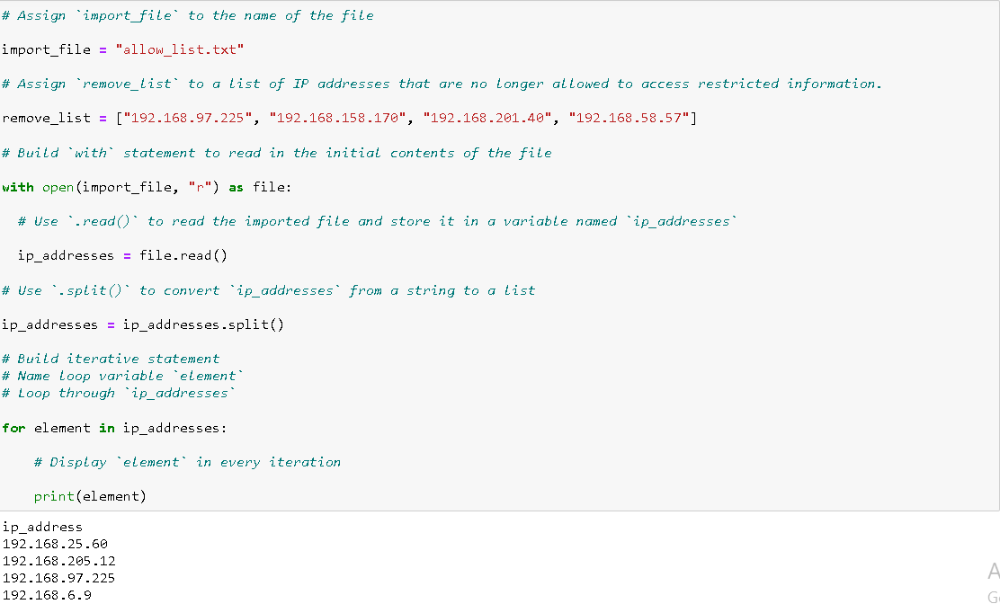
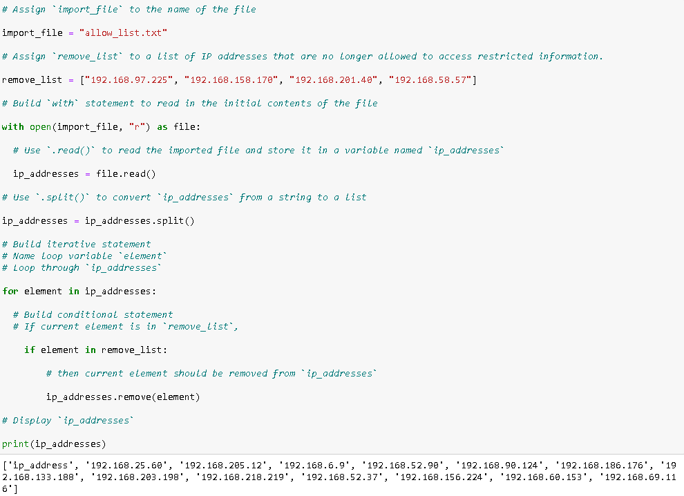
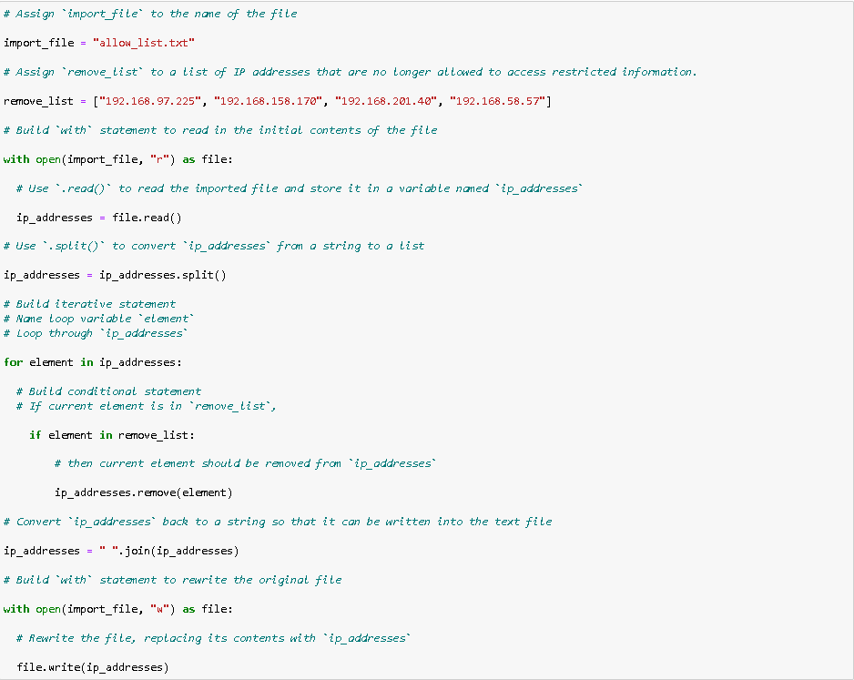

# Automated Access Control List Management Using Python

**Activity:** Algorithm for File Updates in Python  
**Environment:** Jupyter Notebook (Python)  
**Role Assumed:** Security Analyst - Healthcare Organization  
**Tools Utilized:** Python, File I/O Operations (`open()`, `.read()`, `.write()`, `.split()`, `.join()`), Context Managers (`with` statement), Iterative Logic (`for`), Conditional Statements (`if`, `in`)  

---

## Project description
As a security professional at a healthcare company, I am responsible for maintaining strict access controls for systems containing sensitive patient records. Access to these restricted subnetworks is governed by an IP address allow list, which must be regularly updated to remove employees who no longer require access. To automate and secure this process, I developed a Python algorithm that parses the existing allow list, cross-references it against a designated remove list, and automatically purges unauthorized IP addresses. This script ensures our access controls remain accurate, compliant, and resilient against unauthorized access attempts.

---

## Open the file that contains the allow list
To begin the process, I need to access the existing allow list stored in a text file named "allow_list.txt". I assign this filename to a variable called `import_file`. Then, I use Python's `with` statement combined with the `open()` function to safely open the file in read mode ("r"). The `with` keyword is crucial here because it acts as a context manager, ensuring the file is automatically and properly closed after the operations inside the block are completed, preventing resource leaks.

```python
import_file = "allow_list.txt"
with open(import_file, "r") as file:
```


---

## Read the file contents
Once the file is open, I need to extract its contents so Python can analyze the data. I use the `.read()` method on the file object, which reads the entire text file and returns it as a single continuous string. I store this raw string data in a new variable named `ip_addresses`. At this stage, the data is still unstructured text, but it is now loaded into memory and ready for parsing.

```python
with open(import_file, "r") as file:
    ip_addresses = file.read()
```


---

## Convert the string into a list
To manipulate individual IP addresses, the continuous string needs to be broken down into discrete, iterable elements. I apply the `.split()` method to the `ip_addresses` string. By default, `.split()` separates the string at whitespace (like spaces or newline characters) and returns a list of individual strings. I reassign the result back to the `ip_addresses` variable, effectively transforming the data from a single string into a Python list.

```python
ip_addresses = ip_addresses.split()
```


---

## Iterate through the remove list
To identify which IP addresses need to be purged, I set up a `for` loop to iterate through the list of IP addresses. I use `element` as the loop variable, which will temporarily hold each IP address during each iteration. This iterative structure allows the algorithm to systematically check every IP address against the secondary remove list to see if it needs to be revoked.

```python
for element in ip_addresses:
```


---

## Remove IP addresses that are on the remove list
Inside the `for` loop, I nest an `if` conditional statement to check if the current `element` actually exists within the `remove_list` using the `in` operator. If the condition evaluates to `True`, I apply the `.remove()` method to the `ip_addresses` list, passing `element` as the argument to delete that specific IP address. Applying the .remove() method in this way is possible because there are no duplicates in the ip_addresses list. This ensures that the script only attempts to remove valid, existing entries without throwing errors.

```python
for element in ip_addresses:
    if element in remove_list:
        ip_addresses.remove(element)
```


---

## Update the file with the revised list of IP addresses 
After purging the unauthorized IPs from the list in memory, I need to save the updated allow list back to the text file. First, I convert the `ip_addresses` list back into a single string using the `.join()` method. I apply `.join()` to the string `"\n"` in order to separate the elements in the file by placing them on a new line. Next, I use a second `with` statement to open the `import_file` again, this time in write mode ("w"). Inside this block, I use the `.write()` method to overwrite the file's old contents with the newly formatted, sanitized string.

```python
ip_addresses = "\n".join(ip_addresses)
with open(import_file, "w") as file:
    file.write(ip_addresses)
```


---

## Summary
This Python algorithm provides a reliable, automated solution for maintaining secure access control lists in a healthcare environment where data protection is paramount. By leveraging file I/O operations like `open()`, `.read()`, and `.write()`, the script seamlessly interacts with external text files while maintaining data integrity. The strategic use of `.split()` and `.join()` effectively bridges the gap between unstructured text data and structured Python lists, enabling precise data manipulation. Furthermore, combining a `for` loop with an `if` conditional and the `.remove()` method ensures that only authorized IP addresses remain in the system, automatically enforcing access policies. Ultimately, this automation reduces human error, ensures strict compliance with patient data access regulations, and strengthens the organization's overall security posture against unauthorized access.
```

---

📄 [View Full Strategy Document (PDF)](./algorithm-for-file-updates-in-python.pdf)


*Note: This document outlines my hands-on practice and learning proficiency in Python algorithm development, file I/O operations, data parsing and manipulation, and automated access control management required for cybersecurity operations.*